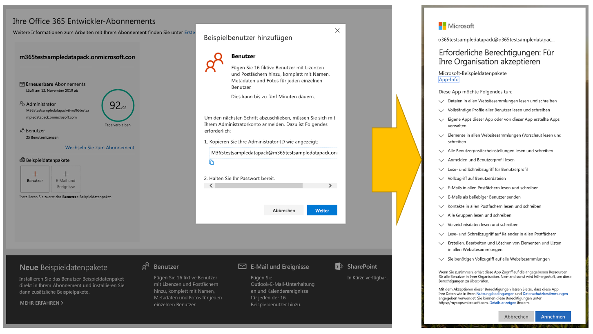
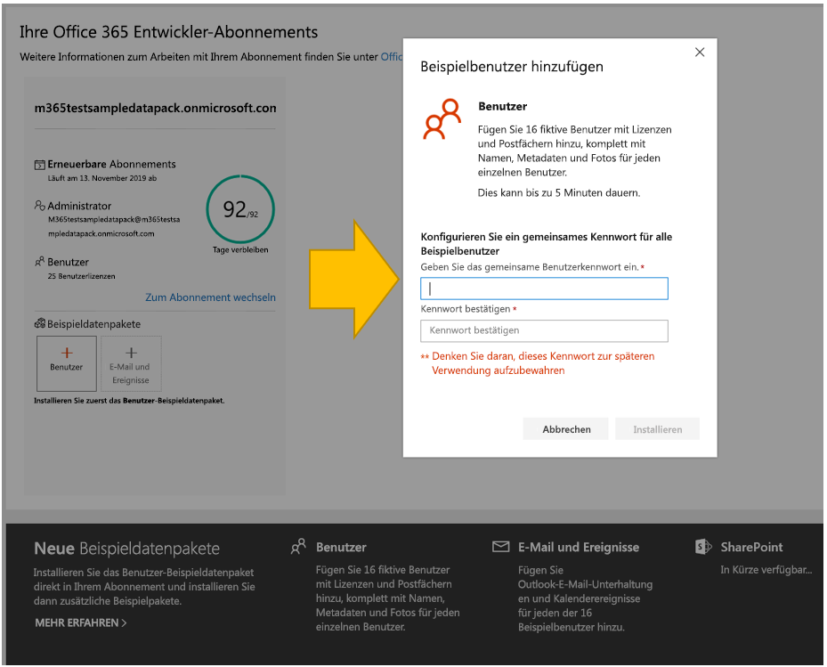
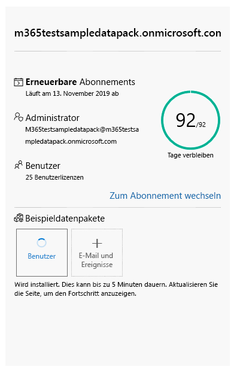
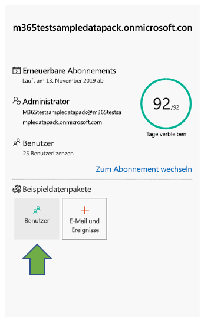
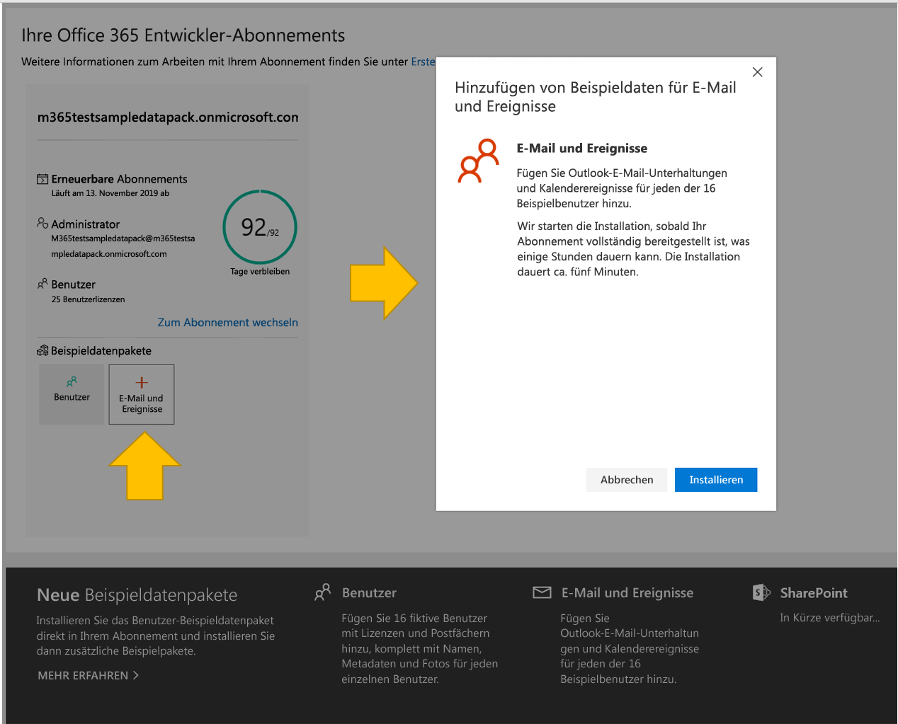
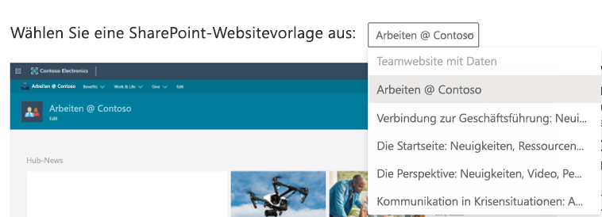
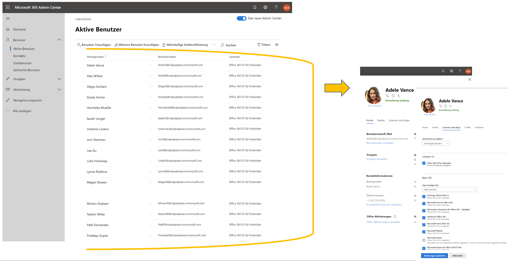
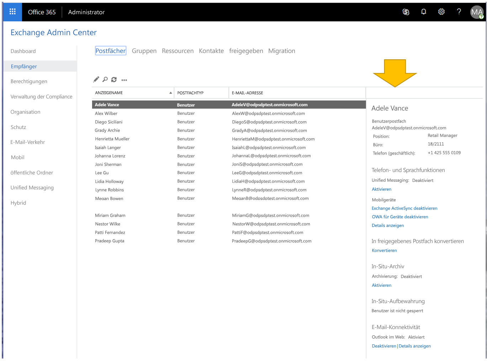

# Beispieldaten für die Entwickler-Sandbox

Ihr Sandbox-Abonnement für das Microsoft 365-Entwicklerprogramm enthält Beispieldaten, mit denen Sie Zeit sparen können, indem Sie Daten und Inhalte bereitstellen, die Sie zum Erstellen und Testen Ihrer Lösungen benötigen.

## In der Instant-Sandbox installierte Beispieldaten

Wenn Sie über eine Instant-Sandbox verfügen, sind die Beispieldatenpakete bereits vorinstalliert. Ihre Instant-Sandbox enthält die folgenden Beispieldaten:

- **Microsoft Graph Benutzer-, E-Mail- und Kalenderdaten** – 16 Beispielbenutzer mit Benutzerdaten und -inhalten, die Sie beim Modellieren Ihrer Lösungen unterstützen. Dies schließt Benutzerpostfächer, Kalenderereignisse und die Integration in eine Teams-Entwicklerumgebung mit simulierten Chats und Teammitgliedschaften ein.
- **Teams-Beispieldatenpaket** mit der folgenden benutzerdefinierten Entwicklerumgebung:
  - **Das Querladen von Apps** ist vorkonfiguriert
  - **Fünf Beispielteams, -Kanäle, -Registerkarten und -Chatsitzungen**, die auf den 16 Beispielbenutzern basieren.
  - **App Studio/Teams-Entwicklerportal sind vorinstalliert und angeheftet**, damit Sie die Erstellung Ihres Teams-App-Manifests und -App-Pakets sowie des Karteneditors und einer React-Steuerelementbibliothek optimieren können.
    
    
- **SharePoint-Framework Beispieldaten** – Wählen Sie aus sechs Sitevorlagen, die Sie als benutzerdefinierte Lösungen für Ihr Unternehmen installieren und auswerten können (wobei eine vorinstalliert ist).

## Installieren von Beispieldatenpakete in Ihrer konfigurierbaren Sandbox

Wenn Sie über eine konfigurierbare Sandbox verfügen, können Sie die Beispieldaten schnell installieren, sodass Sie sich auf Ihre Lösungen konzentrieren können, anstatt selbst Zeit mit der Erstellung von Beispieldaten zu verbringen.

> [!NOTE] 
> Sie können keine Beispieldatenpakete in einem anderen Microsoft 365-Abonnement installieren. Diese Beispieldatenpakete sind nur mit dem Microsoft 365-Entwickler-Sandbox-Abonnement kompatibel, das Sie im Rahmen des Microsoft 365-Entwicklerprogramms erhalten.

Beispieldatenpakete finden Sie im [Dashboard des Microsoft 365-Entwicklerprogramms](https://developer.microsoft.com/microsoft-365/profile) am unteren Rand der Kachel für Ihr Abonnement.

Die folgenden Beispieldatenpakete sind zurzeit verfügbar:

- Benutzer: Installiert 16 Beispielbenutzer mit Lizenzen, Postfächern und Metadaten, einschließlich Namen und Fotos für jeden Benutzer. Mit Microsoft Graph-APIs können Sie auf folgende Weise mit Benutzerbeispieldaten arbeiten:
  - Bestimmte Benutzerdetails abrufen
  - Benutzer aktualisieren
  - Mitarbeiter abrufen
  - Organigramm vorbereiten  
  - Benutzer nach Abteilung abrufen

- E-Mail und Ereignisse – Fügt Outlook-E-Mail-Konversationen und Kalenderereignisse für jeden der 16 Beispielbenutzer hinzu. Mit Microsoft Graph-APIs können Sie auf folgende Weise mit Mail- und Ereignisbeispieldaten arbeiten:
  - E-Mails nach Benutzer abrufen
  - E-Mails nach Datum gefiltert abrufen
  - Bevorstehende Ereignisse abrufen
  - Bevorstehende Ereignisse aktualisieren/löschen

  > [!NOTE]
  > Sie müssen das Beispieldatenpaket "Benutzer" installieren, bevor Sie "E-Mails und Ereignisse" installieren.
    
- SharePoint-Framework Beispieldaten – Wählen Sie aus sechs Sitevorlagen, die Sie als benutzerdefinierte Lösungen für Ihr Unternehmen installieren und auswerten können (wobei eine vorinstalliert ist).

### Installieren des Beispieldatenpakets "Benutzer"

Bevor Sie das Beispieldatenpaket "Benutzer" installieren, stellen Sie sicher, dass Sie über ein Microsoft 365 Developer-Abonnement verfügen, und weisen Sie sich selbst eine Administratorlizenz zu.

> [!NOTE]
> Stellen Sie sicher, dass in Ihrem Abonnement 16 Benutzer verfügbar sind. Ihr Abonnement umfasst 25 Benutzer. Wenn Sie bereits mehr als 10 Benutzer konfiguriert haben, entfernen Sie zuerst einige Benutzer, damit die Installation erfolgreich durchgeführt werden kann.

So installieren Sie das Beispieldatenpaket "Benutzer":

1. Aktivieren Sie am unteren Rand der Kachel für Ihr Abonnement das Kontrollkästchen **Benutzer**.
2. Kopieren Sie Ihre Administrator-ID. Sie benötigen diese, um sich bei Ihrem Abonnement anzumelden.
3. Geben Sie Ihre Administrator-ID und das Kennwort auf der Anmeldeseite ein.
4. Stimmen Sie den Berechtigungen als Administrator Ihres Microsoft 365 Developer-Abonnements zu.

  

5. Konfigurieren Sie Kennwörter für alle Beispielbenutzer. Sie sollten ein gemeinsames Kennwort verwenden, um die Verwaltung ihrer fiktiven Benutzer zu erleichtern.

  

6. Die Daten werden installiert. Die Installation dauert ca. fünf Minuten.

  

7. Nach Abschluss der Installation werden Sie per E-Mail benachrichtigt, und das Feld auf der Kachel für Ihr Abonnement wird grün angezeigt. Jetzt können Sie das Beispieldatenpaket "E-Mails und Ereignisse" installieren.

  

### Beispieldatenpaket Mail & Events installieren

Nachdem Sie das Beispieldatenpaket "Benutzer" installiert haben, können Sie "E-Mails und Ereignisse" installieren.

1. Wählen Sie auf der Kachel für Ihr Abonnement das Feld **E-Mails &amp; Ereignisse** aus.
2. Wählen Sie **Installieren** aus, um mit der Installation zu beginnen.

  

  > [!NOTE]
  > Wenn Sie Ihr Abonnement soeben erstellt haben, muss es vollständig bereitgestellt sein, bevor die Installation beginnen kann. Dies kann bis zu einigen Stunden dauern. Nach Beginn der Installation kann es bis zu 20 Minuten dauern, bis der Vorgang abgeschlossen ist.

3. Nach Abschluss der Installation werden Sie per E-Mail benachrichtigt, und das Feld auf der Kachel für Ihr Abonnement wird grün angezeigt.

### Installieren Sie das SharePoint-Beispieldatenpaket

Das SharePoint-Beispieldatenpaket enthält sechs verschiedene SharePoint-Sitevorlagen zur Auswahl, um SharePoint-Lösungen für Zusammenarbeit, Kommunikation, Engagement und Wissensmanagement zu erleben und zu modellieren.

Dies sind einige der beliebtesten Vorlagen aus dem [SharePoint PnP-Look Book](https://provisioning.sharepointpnp.com/). Heute ist es einfach, Beispiellösungen für schöne, schnelle Sites und Seiten zu erstellen, die auf jedem Gerät oder Bildschirm perfekt dargestellt werden. Lassen Sie sich von diesen Designs inspirieren, oder fügen Sie sie Ihrem Sandkasten-Mandanten hinzu, um mit dem Erstellen Ihrer nächsten Site zu beginnen.

Die Vorlagen können im Rahmen Ihres Abonnements installiert werden. Nachdem Sie eine Vorlage installiert haben, haben Sie die Möglichkeit, die anderen zu installieren. Der Installationsprozess umfasst die folgenden Schritte:

1. Wählen Sie im Dropdownmenü die Vorlage aus, die Sie verwenden möchten.

  

2. Konfigurieren Sie benutzerdefinierte Optionen für Ihre Sites, oder übernehmen Sie die Standardwerte.
3. Verwenden Sie die Administrator-ID Ihres Sandkasten-Mandanten und das Kennwort für die Authentifizierung und zum Erteilen von Installationsberechtigungen. 

Die Installation wird automatisch durchgeführt.

>**Hinweis:** Die Bereitstellung dieser Sitevorlagen ist nur mit der englischen Version von Office 365 E3- oder Microsoft 365 E5-Entwickler-Abonnements möglich, und alle enthaltenen Inhalte sind ausschließlich in Englisch verfügbar.

#### Welche SharePoint-Vorlagen sind verfügbar?

Das SharePoint-Beispielpaket enthält sieben verschiedene Vorlagen.

#### Teamsite mit Daten

Diese Teamsite mit Datenvorlage umfasst mehrere Listen und Dokumentbibliotheken, die automatisch einer SharePoint-Teamsite zugeordnet sind, um Ihnen dabei zu helfen, Lösungen mithilfe von SharePoint-Framework, Power Apps und Microsoft Graph zu entwickeln.

Diese Vorlage umfasst die folgenden Daten:

- Eine Kontaktliste mit voraufgefüllten Kontakten
- Eine mit mehr als 6.000 Elementen aufgefüllte Liste
- Dokumentbibliotheken mit PowerPoint-, Excel-, Word- und OneNote-Beispieldokumenten
- Eine Ereignisliste mit Ankündigungselementen

Diese Vorlage ist in die Benutzer-Beispieldaten integrierbar.

#### Work @ Contoso
Die Vorlage “Work @ Contoso” besteht aus mehreren Sitesammlungen, die alle automatisch der Hubwebsite zugeordnet sind, um zu zeigen, wie alle standardmäßigen Aggregationsfunktionen angewendet werden.

Diese Vorlage enthält folgende Strukturen und Objekte:

- Hauptwebsitesammlungssatz als Hubwebsite
- Zwei Kommunikationswebsites, die der Hubwebsite zugeordnet sind – Vorteile und Charity-Websites
- Eine Gruppenteamwebsite, die der Hub-Website zugeordnet ist – Teamwebsite
- Beispiele für Nachrichtenartikel in den Unterwebsitesammlungen
- Beispiele für Word-, Excel- und PowerPoint-Dateien
- Beispielbildinhalte, die in den Websitesammlungen verwendet werden

Unterwebsitesammlungen verwenden dieselben Beispielvorlagen, die Sie auch separat über diesen Dienst bereitstellen können.

>**Hinweis:** Wenn diese Vorlage auf eine vorhandene Kommunikationswebsite angewendet wird, wird der Inhalt der Willkommensseite der Site überschrieben.

#### Leadership Connection: Nachrichten, Ereignisse und Engagement zu Führungsqualitäten

Diese Site für Führungskräfte bietet Erkenntnisse zu den Zielen und Prioritäten des Führungsteams, und fördert das Engagement durch Veranstaltungen und Unterhaltungen.

Wenn Sie dieses Design zu Ihrem Mandanten hinzufügen, werden folgende Inhalte erstellt:

- Beispiel für eine Willkommensseite mit Demonstration von Webparts
- Beispiele für News-Artikel, mit deren Hilfe verschiedene moderne Seitendesigns veranschaulicht werden

Diese Vorlage ist in die Benutzer-Beispieldaten integrierbar.

#### Die Zielsite: Neuigkeiten, Ressourcen, personalisierte Inhalte

Auf dieser Kommunikationswebsite sollen Ihre Mitarbeiter die Neuigkeiten und Ressourcen finden können, die sie benötigten, sowie personalisierte Inhalte, die genau auf sie zugeschnitten sind.

Wenn Sie dieses Design zu Ihrem-Mandanten hinzufügen, wird der folgende Inhalt erstellt:

- Struktur für die Startseite des Portals zu Demonstrationszwecken
- Struktur einer benutzerdefinierten Willkommensseite
- Sechs weitere Beispiele für moderne Seiten und News-Artikel
- Beispiele für Bilder und Office-Dokumente

#### Die Perspektive: Neuigkeiten, Videos, personalisierte Inhalte

Diese Website soll Neuigkeiten und personalisierte Inhalte bieten und umfasst auch Videos, um das Engagement noch stärker zu fördern.
Wenn Sie dieses Design zu Ihrem-Mandanten hinzufügen, wird der folgende Inhalt erstellt:

- Designs für benutzerdefinierte Willkommensseiten
- Beispiele für Vorlagenseiten für Nachrichtenartikel
- Zwölf Beispiele für News-Artikel

#### Krisenkommunikation: Ankündigungen, Neuigkeiten, Ressourcen, Communities und Calls-to-Action

Sorgen Sie dafür, dass die Menschen in Krisensituationen wie Naturkatastrophen oder Notfällen hinsichtlich der Gesundheit und Sicherheit informiert und engagiert bleiben, und den Blick nach vorne richten. Mit dieser Vorlage wird eine zentrale Ressource für Führungskräfte und Kommunikatoren erstellt, um wichtige Neuigkeiten und Ankündigungen zu veröffentlichen; eine zentrale Informationsquelle, damit alle auf dem neuesten Stand bleiben können, und ein Ort, an dem Personen in der gesamten Organisation miteinander in Kontakt treten können.

Wenn Sie dieses Design zu Ihrem Mandanten hinzufügen, werden folgende Inhalte erstellt:

- Benutzerdefinierte Willkommensseite, die mithilfe eines Webparts erstellt wird
- Vier News-Artikel mit Beispielinhalten

Diese Vorlage ist in die Benutzer-Beispieldaten integrierbar.

## Kann ich Beispieldatenpakete unter meinen anderen Microsoft 365-Abonnements installieren?

Nein. Diese Beispieldatenpakete sind nur mit dem im Rahmen des Microsoft 365-Entwicklerprogramms bereitgestellten Microsoft 365 Developer-Abonnement kompatibel.

## Wie kann ich die Beispieldaten in meinem Abonnement anzeigen?

Um die Beispieldaten für Benutzer anzuzeigen, wechseln Sie zum [**Microsoft 365 Admin Center**](https://admin.microsoft.com/) in Ihrem Microsoft 365-Entwicklerabonnement. Wählen Sie unter **Benutzer** die Option **Aktive Benutzer** aus. Es wird eine Liste mit 16 Benutzern angezeigt. Sie können einen Benutzer auswählen, um die zugehörigen Metadaten anzuzeigen, z. B. Fotos und Lizenzen.

Um die Beispieldaten für E-Mail und Ereignisse anzuzeigen, wählen Sie im [**Microsoft 365 Admin Center**](/microsoft-365/admin/admin-overview/about-the-admin-center?view=o365-worldwide) **Alle anzeigen** aus, und wählen Sie dann **Exchange** aus. Wenn Sie im Exchange Admin Center die Option **Empfänger** auswählen, können Sie sehen, dass jedem der 16 Benutzer Postfächer mit E-Mail-Nachrichten und Ereignissen hinzugefügt wurden.

Um die Microsoft Teams-Beispieldaten anzuzeigen, wechseln Sie zu **Teams** in Ihrem Microsoft 365 E5 Abonnement. Auf der Registerkarte "Teams" ’ werden einige vorab erstellte Teams mit Chats von Beispielbenutzern im **Mark 8 Project Team** angezeigt. Die App Studio/Dev Portal-App ist vorinstalliert und an den Navigationsbereich angeheftet.

Um die SharePoint-Beispieldaten anzuzeigen, wechseln Sie zum SharePoint Admin Center, und wählen Sie in der linken Navigation **"Aktive Sites"** aus. Sie können die vorinstallierten Beispiel-Sites und alle zusätzlichen Site-Vorlagen sehen, die Sie in Ihrer Sandbox installieren.

## Weitere Artikel

- [Einrichten eines Microsoft 365 Developer-Abonnements](microsoft-365-developer-program-get-started.md)
