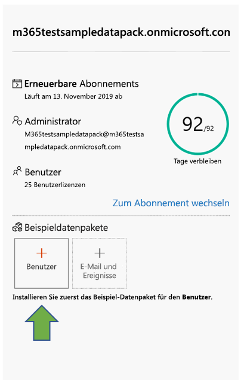

# Verwenden von Beispieldatenpaketen mit Ihrem Office 365 Developer-Abonnement

Sie können Beispieldatenpakete unter Ihrem Office 365 Developer-Abonnement installieren. Mit Beispieldatenpaketen sparen Sie Zeit, indem automatisch Daten und Inhalte installiert werden, die Sie zum Erstellen und Testen Ihrer Lösungen benötigen. Dies umfasst Beispielbenutzer, Metadaten und Fotos, um eine kleine Unternehmensumgebung zu simulieren. Die Beispieldaten lassen sich schnell installieren, sodass Sie sich auf ihre Lösungen konzentrieren können, statt Zeit für die Erstellung von Beispieldaten aufzuwenden.

Beispieldatenpakete finden Sie im [Dashboard des Office 365-Entwicklerprogramms](https://developer.microsoft.com/office/profile) am unteren Rand der Kachel für Ihr Office 365-Abonnement.

Die folgenden Beispieldatenpakete sind zurzeit verfügbar:

- Benutzer: Installiert 16 Beispielbenutzer mit Lizenzen, Postfächern und Metadaten, einschließlich Namen und Fotos für jeden Benutzer. Mit Microsoft Graph-APIs können Sie auf folgende Weise mit Benutzerbeispieldaten arbeiten:
  - Bestimmte Benutzerdetails abrufen
  - Benutzer aktualisieren
  - Mitarbeiter abrufen
  - Organigramm vorbereiten  
  - Benutzer nach Abteilung abrufen

- E-Mails und Ereignisse: Fügt Outlook E-Mail-Unterhaltungen und Kalenderereignisse für jeden der 16 Beispielbenutzer hinzu. Mit Microsoft Graph-APIs können Sie auf folgende Weise mit Mail- und Ereignisbeispieldaten arbeiten:
  - E-Mails nach Benutzer abrufen
  - E-Mails nach Datum gefiltert abrufen
  - Bevorstehende Ereignisse abrufen
  - Bevorstehende Ereignisse aktualisieren/löschen

> [!NOTE]
> Sie müssen das Beispieldatenpaket "Benutzer" installieren, bevor Sie "E-Mails und Ereignisse" installieren.

## Welche Elemente werden durch die Beispieldatenpakete zu meinem Office 365-Abonnement hinzugefügt?

Das Beispieldatenpaket "Benutzer" erstellt in Ihrem Abonnement 16 Beispielbenutzer, einschließlich der Lizenzen sowie Postfächer, Namen, Metadaten und Fotos für jeden Benutzer.

Das Beispieldatenpaket "E-Mails und Ereignisse" fügt Outlook E-Mail-Unterhaltungen und Kalenderereignisse für jeden der 16 installierten Benutzer hinzu.

## Wie installiere ich das Beispieldatenpaket "Benutzer"?

Bevor Sie das Beispieldatenpaket "Benutzer" installieren, stellen Sie sicher, dass Sie über ein Office 365-Entwicklerabonnement verfügen, und weisen Sie sich selbst eine Administratorlizenz zu.

> [!NOTE]
> Stellen Sie sicher, dass in Ihrem Abonnement 16 Benutzer verfügbar sind. Ihr Abonnement umfasst 25 Benutzer. Wenn Sie bereits mehr als 10 Benutzer konfiguriert haben, entfernen Sie zuerst einige Benutzer, damit die Installation erfolgreich durchgeführt werden kann.

So installieren Sie das Beispieldatenpaket "Benutzer":

1. Aktivieren Sie am unteren Rand der Kachel für Ihr Abonnement das Kontrollkästchen **Benutzer**.
2. Kopieren Sie Ihre Administrator-ID. Sie benötigen diese, um sich bei Ihrem Abonnement anzumelden.
3. Geben Sie Ihre Administrator-ID und das Kennwort auf der Anmeldeseite ein.
4. Stimmen Sie den Berechtigungen als Administrator Ihres Office 365 Developer-Abonnements zu.

5. Konfigurieren Sie die Kennwörter für alle Beispielbenutzer. Sie sollten ein gemeinsames Kennwort verwenden, um die Verwaltung ihrer Beispielbenutzer zu erleichtern.

6. Die Daten werden installiert. Die Installation dauert ca. fünf Minuten.

7. Nach Abschluss der Installation werden Sie per E-Mail benachrichtigt, und das Feld auf der Kachel für Ihr Abonnement wird grün angezeigt. Jetzt können Sie das Beispieldatenpaket "E-Mails und Ereignisse" installieren.

## Wie installiere ich das Beispieldatenpaket "E-Mails und Ereignisse"?

Nachdem Sie das Beispieldatenpaket "Benutzer" installiert haben, können Sie "E-Mails und Ereignisse" installieren.

1. Wählen Sie auf der Kachel für Ihr Abonnement das Feld **E-Mails &amp; Ereignisse** aus.
2. Wählen Sie **Installieren** aus, um mit der Installation zu beginnen.

> [!NOTE]
> Wenn Sie Ihr Abonnement soeben erstellt haben, muss es vollständig bereitgestellt sein, bevor die Installation beginnen kann. Dies kann bis zu einigen Stunden dauern. Nach Beginn der Installation kann es bis zu 20 Minuten dauern, bis der Vorgang abgeschlossen ist.

3. Nach Abschluss der Installation werden Sie per E-Mail benachrichtigt, und das Feld auf der Kachel für Ihr Abonnement wird grün angezeigt.

## Werden weitere Beispieldatenpakete folgen?

Ja. Wir werden Beispieldatenpakete für SharePoint und OneDrive hinzufügen. Wir erwägen, in Zukunft Beispieldatenpakete für weitere Produkte und Technologien hinzuzufügen, z. B. Office-Add-Ins, Microsoft Teams und vieles mehr.

## Kann ich Beispieldatenpakete unter meinen anderen Office 365-Abonnements installieren?

Nein. Diese Beispieldatenpakete sind nur mit dem im Rahmen des Office 365-Entwicklerprogramms bereitgestellten Office 365 Developer-Abonnement kompatibel.

## Wie kann ich die Beispieldaten in meinem Abonnement anzeigen?

Nachdem Sie das Beispieldatenpaket "Benutzer" installiert haben, um die hinzugefügten Benutzer anzuzeigen, wechseln Sie in Ihrem Office 365 Developer-Abonnement zum **Microsoft 365 Admin Center**. Wählen Sie unter **Benutzer** die Option **Aktive Benutzer** aus. Es wird eine Liste mit 16 Benutzern angezeigt. Sie können einen Benutzer auswählen, um die zugehörigen Metadaten anzuzeigen, z. B. Fotos und Lizenzen.

Wenn Sie nach dem Installieren des Beispielpakets "E-Mail und Ereignisse" die Beispieldaten anzeigen möchten, wählen Sie im **Microsoft 365 Admin Center** die Option **Alle anzeigen** und dann **Exchange** aus. Wenn Sie im Exchange Admin Center die Option **Empfänger** auswählen, können Sie sehen, dass jedem der 16 Benutzer Postfächer mit E-Mail-Nachrichten und Ereignissen hinzugefügt wurden.

## Siehe auch

- [Richten Sie ein Office 365-Entwicklerabonnement ein](office-365-developer-program-get-started.md)
