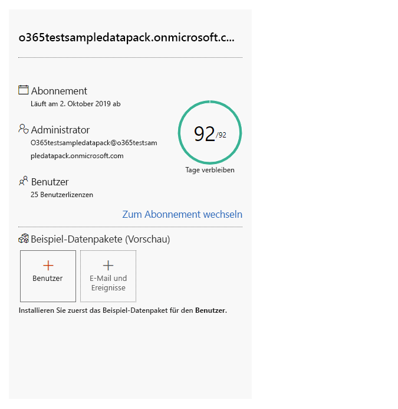
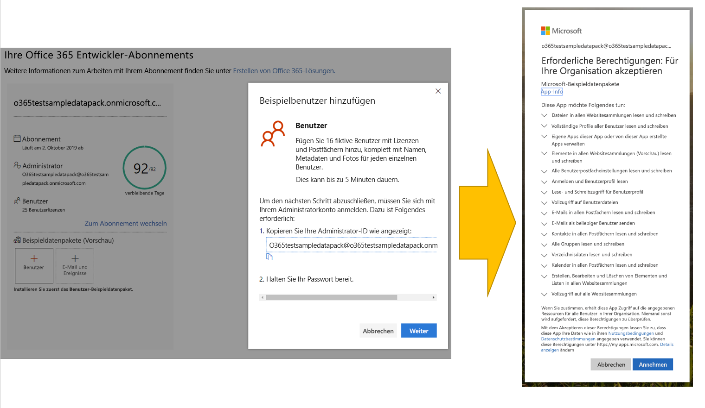
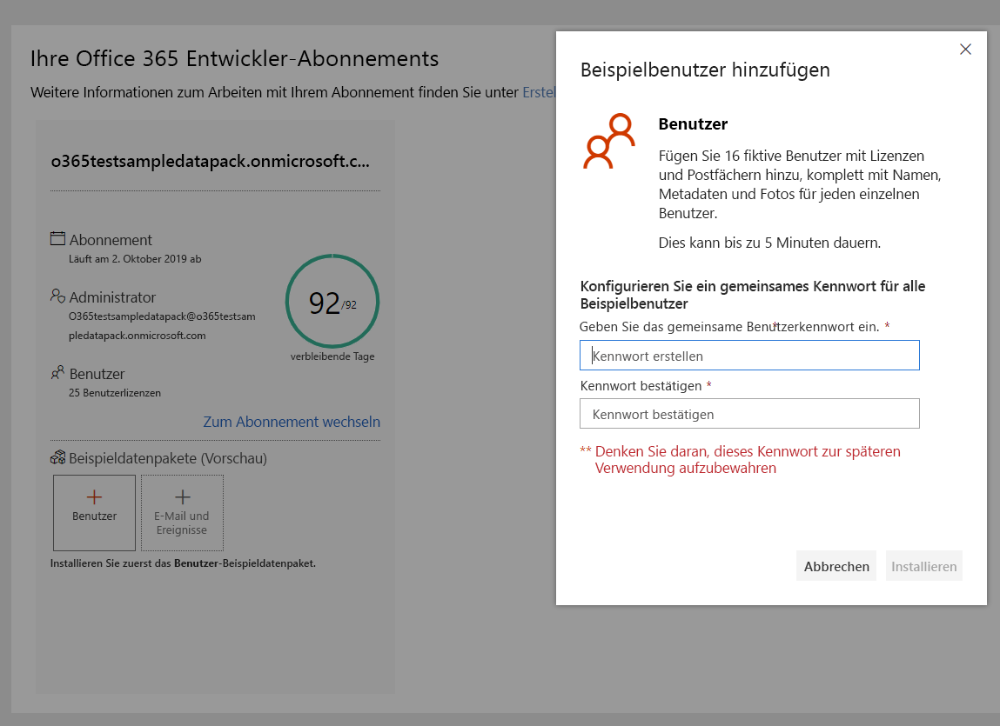
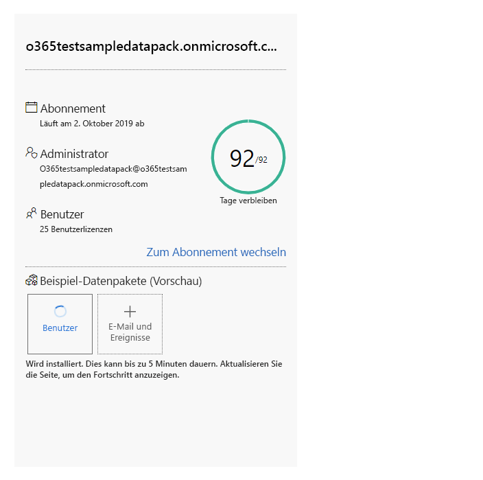
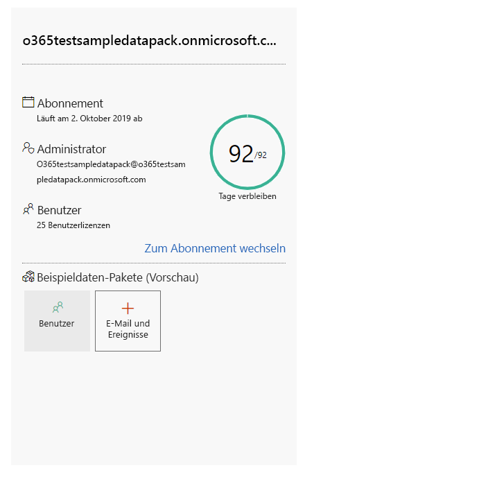
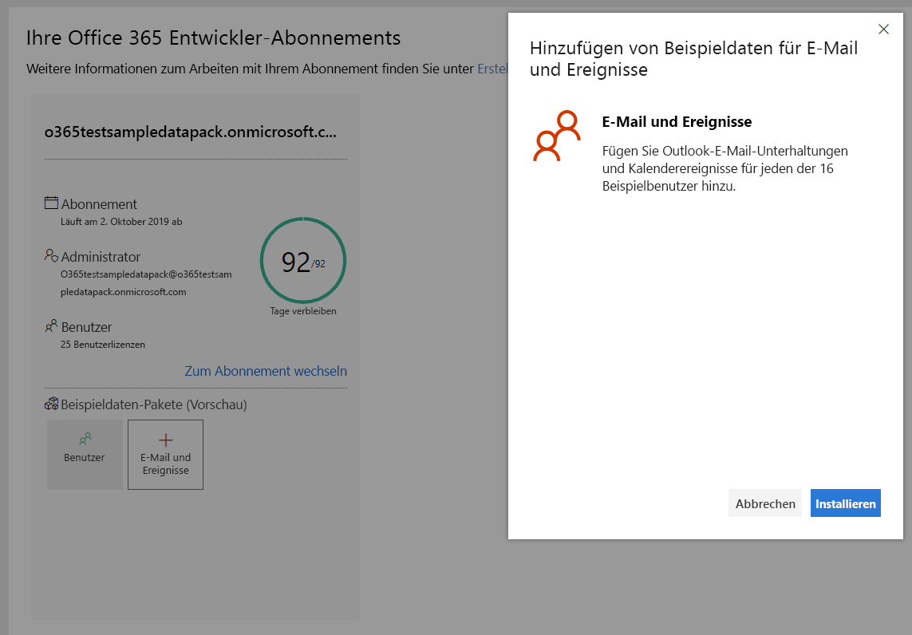

# Verwenden von Beispieldatenpaketen mit Ihrem Office 365 Developer-AbonnementUse sample data packs with your Office 365 developer subscription

Sie können Beispieldatenpakete unter Ihrem Office 365 Developer-Abonnement installieren.You can install sample data packs on your Office 365 developer subscription. Mit Beispieldatenpaketen sparen Sie Zeit, indem automatisch Daten und Inhalte installiert werden, die Sie zum Erstellen und Testen Ihrer Lösungen benötigen.Sample data packs save you time by automatically installing data and content you need to build and test your solutions. Dies umfasst Beispielbenutzer, Metadaten und Fotos, um eine kleine Unternehmensumgebung zu simulieren.This includes fictitious users, metadata, and photos to simulate a small corporate environment. Die Beispieldaten lassen sich schnell installieren, sodass Sie sich auf ihre Lösungen konzentrieren können, statt Zeit für die Erstellung von Beispieldaten aufzuwenden.You can quickly install the sample data so that you can focus on your solutions rather than spend time creating sample data yourself.

Beispieldatenpakete finden Sie im [Dashboard des Office 365-Entwicklerprogramms](https://developer.microsoft.com/office/profile) am unteren Rand der Kachel für Ihr Office 365-Abonnement.You can find sample data packs on your [Office 365 Developer Program dashboard](https://developer.microsoft.com/office/profile), at the bottom of your Office 365 subscription tile.

Die folgenden Beispieldatenpakete sind zurzeit verfügbar:The following sample data packs are currently available:

- Benutzer: Installiert 16 Beispielbenutzer mit Lizenzen, Postfächern und Metadaten, einschließlich Namen und Fotos für jeden Benutzer.Users - Installs 16 fictitious users with licenses, mailboxes, and metadata, including names and photos for each user. Mit Microsoft Graph-APIs können Sie auf folgende Weise mit Benutzerbeispieldaten arbeiten:Use Microsoft Graph APIs to work with user sample data in the following ways:
  - Bestimmte Benutzerdetails abrufenGet specific user details
  - Benutzer aktualisierenUpdate user
  - Mitarbeiter abrufenGet user's direct reports.
  - Organigramm vorbereitenPrepare organization chart  
  - Benutzer nach Abteilung abrufenGet users by department

- E-Mails und Ereignisse: Fügt Outlook E-Mail-Unterhaltungen und Kalenderereignisse für jeden der 16 Beispielbenutzer hinzu.Mail and events - Adds Outlook email conversations and calendar events for each of the 16 sample users. Mit Microsoft Graph-APIs können Sie auf folgende Weise mit Mail- und Ereignisbeispieldaten arbeiten:Use Microsoft Graph APIs to work with mail and events sample data in the following ways:
  - E-Mails nach Benutzer abrufenGet emails by users
  - E-Mails nach Datum gefiltert abrufenGet emails filtered by date
  - Bevorstehende Ereignisse abrufenGet upcoming events
  - Bevorstehende Ereignisse aktualisieren/löschenUpdate/delete upcoming events

> [!NOTE]
> Sie müssen das Beispieldatenpaket "Benutzer" installieren, bevor Sie "E-Mails und Ereignisse" installieren.You must install the Users sample data pack before you install Mail and Events.

## Welche Elemente werden durch die Beispieldatenpakete zu meinem Office 365-Abonnement hinzugefügt?What do the sample data packs add to my Office 365 subscription?

Das Beispieldatenpaket "Benutzer" erstellt in Ihrem Abonnement 16 Beispielbenutzer, einschließlich der Lizenzen sowie Postfächer, Namen, Metadaten und Fotos für jeden Benutzer.The Users sample data pack creates 16 fictitious users on your subscription, and includes the licenses for each user, and mailboxes, names, metadata, and photos for each.

Das Beispieldatenpaket "E-Mails und Ereignisse" fügt Outlook E-Mail-Unterhaltungen und Kalenderereignisse für jeden der 16 installierten Benutzer hinzu.The Mail and Events sample data pack adds Outlook email conversations and calendar events for each of the 16 users installed.

## Wie installiere ich das Beispieldatenpaket "Benutzer"?How do I install the Users sample data pack?

Bevor Sie das Beispieldatenpaket "Benutzer" installieren, stellen Sie sicher, dass Sie über ein Office 365 Developer-Abonnement verfügen und dass Sie sich selbst eine Lizenz als Administrator zuweisen.Before you install the Users sample data pack, make sure that you have an Office 365 developer subscription and that you assign a license to yourself as the admin.

So installieren Sie das Beispieldatenpaket "Benutzer":To install the Users sample data pack:

1. Aktivieren Sie am unteren Rand der Kachel für Ihr Abonnement das Kontrollkästchen **Benutzer**.Select the **Users** box at the bottom of your subscription tile.
2. Kopieren Sie Ihre Administrator-ID. Sie benötigen diese, um sich bei Ihrem Abonnement anzumelden.Copy your administrator ID; you will need it to sign in to your subscription.
3. Geben Sie Ihre Administrator-ID und das Kennwort auf der Anmeldeseite ein.Enter your administrator ID and password on the sign in page.
4. Stimmen Sie den Berechtigungen als Administrator Ihres Office 365 Developer-Abonnements zu.Consent to the permissions as an administrator of your Office 365 developer subscription.

5. Konfigurieren Sie die Kennwörter für alle Beispielbenutzer.Configure your passwords for all sample users. Sie sollten ein gemeinsames Kennwort verwenden, um die Verwaltung ihrer Beispielbenutzer zu erleichtern.You will need to have one shared password defined for easy administration of all your fictitious users.

6. Die Daten werden installiert.The existing data will be overwritten. Die Installation dauert ca. fünf Minuten.The installation should take about 5 minutes.

7. Nach Abschluss der Installation werden Sie per E-Mail benachrichtigt, und das Feld auf der Kachel für Ihr Abonnement wird grün angezeigt.When installation is finished, you'll be notified by email, and the box on your subscription tile will be green. Jetzt können Sie das Beispieldatenpaket "E-Mails und Ereignisse" installieren.You can now install the Mail and Events sample data pack.

## Wie installiere ich das Beispieldatenpaket "E-Mails und Ereignisse"?How do I install the Mail and Events sample data pack?

Nachdem Sie das Beispieldatenpaket "Benutzer" installiert haben, können Sie "E-Mails und Ereignisse" installieren.After you've installed the Users sample data pack, you can install mail and events.

1. Wählen Sie auf der Kachel für Ihr Abonnement das Feld **E-Mails &amp; Ereignisse** aus.Choose the **Mail &amp; Events** box on your subscription tile.
2. Wählen Sie **Installieren** aus, um mit der Installation zu beginnen.Click **Install** to begin the installation.

> [!NOTE]
> Wenn Sie Ihr Abonnement soeben erstellt haben, muss es vollständig bereitgestellt sein, bevor die Installation beginnen kann.If you just created your subscription, it must be fully provisioned before installation can begin. Dies kann bis zu einigen Stunden dauern.This can take up to a few hours. Nach Beginn der Installation kann es bis zu 20 Minuten dauern, bis der Vorgang abgeschlossen ist.After installation starts, it can take up to 20 minutes to finish.

3. Nach Abschluss der Installation werden Sie per E-Mail benachrichtigt, und das Feld auf der Kachel für Ihr Abonnement wird grün angezeigt.When installation is finished, you'll be notified by email, and the box on your subscription tile will be green.

## Werden weitere Beispieldatenpakete folgen?Are more sample data packs coming?

Ja.Yes. Wir werden Beispieldatenpakete für SharePoint und OneDrive hinzufügen.We will add sample data packs for SharePoint and OneDrive. Wir erwägen, in Zukunft Beispieldatenpakete für weitere Produkte und Technologien hinzuzufügen, z. B. Office-Add-Ins, Microsoft Teams und vieles mehr.In the future, we will consider adding sample data packs for more products and technologies, including Office Add-ins, Microsoft Teams, and more.

## Kann ich Beispieldatenpakete unter meinen anderen Office 365-Abonnements installieren?Can I install sample data packs on my other Office 365 subscriptions?

Nein.No. Diese Beispieldatenpakete sind nur mit dem im Rahmen des Office 365-Entwicklerprogramms bereitgestellten Office 365 Developer-Abonnement kompatibel.These sample data packs are only compatible with the Office 365 Developer Subscription you get as part of the Office 365 Developer Program.

## Weitere ArtikelSee also

- [Richten Sie ein Office 365-Entwicklerabonnement einSet up an Office 365 developer subscription](office-365-developer-program-get-started.md)
