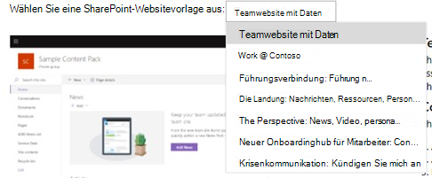

# Verwenden von Beispieldatenpaketen mit Ihrem Abonnement für das Microsoft 365-EntwicklerprogrammUse sample data packs with your Microsoft 365 Developer Program subscription

Sie können Beispieldatenpakete in Ihrem Abonnement für das Microsoft 365-Entwicklerprogramm installieren.You can install sample data packs on your Microsoft 365 Developer Program subscription. Mit Beispieldatenpaketen sparen Sie Zeit, indem automatisch Daten und Inhalte installiert werden, die Sie zum Erstellen und Testen Ihrer Lösungen benötigen.Sample data packs save you time by automatically installing data and content you need to build and test your solutions. Dies umfasst Beispielbenutzer, Metadaten und Fotos, um eine kleine Unternehmensumgebung zu simulieren.This includes fictitious users, metadata, and photos to simulate a small corporate environment. Die Beispieldaten lassen sich schnell installieren, sodass Sie sich auf ihre Lösungen konzentrieren können, statt Zeit für die Erstellung von Beispieldaten aufzuwenden.You can quickly install the sample data so that you can focus on your solutions rather than spend time creating sample data yourself.

Beispieldatenpakete finden Sie im [Dashboard des Microsoft 365-Entwicklerprogramms](https://developer.microsoft.com/office/profile) am unteren Rand der Kachel für Ihr Abonnement.You can find sample data packs on your [Microsoft 365 Developer Program dashboard](https://developer.microsoft.com/office/profile), at the bottom of your subscription tile.

Die folgenden Beispieldatenpakete sind zurzeit verfügbar:The following sample data packs are currently available:

- Benutzer: Installiert 16 Beispielbenutzer mit Lizenzen, Postfächern und Metadaten, einschließlich Namen und Fotos für jeden Benutzer.Users - Installs 16 fictitious users with licenses, mailboxes, and metadata, including names and photos for each user. Mit Microsoft Graph-APIs können Sie auf folgende Weise mit Benutzerbeispieldaten arbeiten:Use Microsoft Graph APIs to work with user sample data in the following ways:
  - Bestimmte Benutzerdetails abrufenGet specific user details
  - Benutzer aktualisierenUpdate user
  - Mitarbeiter abrufenGet direct reports
  - Organigramm vorbereitenPrepare organization chart  
  - Benutzer nach Abteilung abrufenGet users by department

- E-Mails und Ereignisse: Fügt Outlook E-Mail-Unterhaltungen und Kalenderereignisse für jeden der 16 Beispielbenutzer hinzu.Mail and events - Adds Outlook email conversations and calendar events for each of the 16 sample users. Mit Microsoft Graph-APIs können Sie auf folgende Weise mit Mail- und Ereignisbeispieldaten arbeiten:Use Microsoft Graph APIs to work with mail and events sample data in the following ways:
  - E-Mails nach Benutzer abrufenGet emails by users
  - E-Mails nach Datum gefiltert abrufenGet emails filtered by date
  - Bevorstehende Ereignisse abrufenGet upcoming events
  - Bevorstehende Ereignisse aktualisieren/löschenUpdate/delete upcoming events

> [!NOTE]
> Sie müssen das Beispieldatenpaket "Benutzer" installieren, bevor Sie "E-Mails und Ereignisse" installieren.You must install the Users sample data pack before you install Mail and Events.

## Welche Elemente werden durch die Beispieldatenpakete zu meinem Abonnement hinzugefügt?What do the sample data packs add to my subscription?

Das Beispieldatenpaket "Benutzer" erstellt in Ihrem Abonnement 16 Beispielbenutzer, einschließlich der Lizenzen sowie Postfächer, Namen, Metadaten und Fotos für jeden Benutzer.The Users sample data pack creates 16 fictitious users on your subscription, and includes the licenses for each user, and mailboxes, names, metadata, and photos for each.

Das Beispieldatenpaket "E-Mails und Ereignisse" fügt Outlook E-Mail-Unterhaltungen und Kalenderereignisse für jeden der 16 installierten Benutzer hinzu.The Mail and Events sample data pack adds Outlook email conversations and calendar events for each of the 16 users installed.

## Wie installiere ich das Beispieldatenpaket "Benutzer"?How do I install the Users sample data pack?

Bevor Sie das Beispieldatenpaket "Benutzer" installieren, stellen Sie sicher, dass Sie über ein Microsoft 365 Developer-Abonnement verfügen, und weisen Sie sich selbst eine Administratorlizenz zu.Before you install the Users sample data pack, make sure that you have a Microsoft 365 developer subscription and that you assign a license to yourself as the admin.

> [!NOTE]
> Stellen Sie sicher, dass in Ihrem Abonnement 16 Benutzer verfügbar sind.Make sure that you have 16 users available in your subscription. Ihr Abonnement umfasst 25 Benutzer.Your subscription includes 25 users. Wenn Sie bereits mehr als 10 Benutzer konfiguriert haben, entfernen Sie zuerst einige Benutzer, damit die Installation erfolgreich durchgeführt werden kann.If you have already configured more than 10 users, remove some users first to ensure that your installation is successful.

So installieren Sie das Beispieldatenpaket "Benutzer":To install the Users sample data pack:

1. Aktivieren Sie am unteren Rand der Kachel für Ihr Abonnement das Kontrollkästchen **Benutzer**.Select the **Users** box at the bottom of your subscription tile.
2. Kopieren Sie Ihre Administrator-ID. Sie benötigen diese, um sich bei Ihrem Abonnement anzumelden.Copy your administrator ID; you will need it to sign in to your subscription.
3. Geben Sie Ihre Administrator-ID und das Kennwort auf der Anmeldeseite ein.Enter your administrator ID and password on the sign in page.
4. Stimmen Sie den Berechtigungen als Administrator Ihres Microsoft 365 Developer-Abonnements zu.Consent to the permissions as an administrator of your Microsoft 365 developer subscription.

5. Konfigurieren Sie die Kennwörter für alle Beispielbenutzer.Configure your passwords for all sample users. Sie sollten ein gemeinsames Kennwort verwenden, um die Verwaltung ihrer Beispielbenutzer zu erleichtern.You will need to have one shared password defined for easy administration of all your fictitious users.

6. Die Daten werden installiert.The data will be installed. Die Installation dauert ca. fünf Minuten.The installation should take about 5 minutes.

7. Nach Abschluss der Installation werden Sie per E-Mail benachrichtigt, und das Feld auf der Kachel für Ihr Abonnement wird grün angezeigt.When installation is finished, you'll be notified by email, and the box on your subscription tile will be green. Jetzt können Sie das Beispieldatenpaket "E-Mails und Ereignisse" installieren.You can now install the Mail and Events sample data pack.

## Wie installiere ich das Beispieldatenpaket "E-Mails und Ereignisse"?How do I install the Mail and Events sample data pack?

Nachdem Sie das Beispieldatenpaket "Benutzer" installiert haben, können Sie "E-Mails und Ereignisse" installieren.After you've installed the Users sample data pack, you can install mail and events.

1. Wählen Sie auf der Kachel für Ihr Abonnement das Feld **E-Mails &amp; Ereignisse** aus.Choose the **Mail &amp; Events** box on your subscription tile.
2. Wählen Sie **Installieren** aus, um mit der Installation zu beginnen.Select **Install** to begin installation.

> [!NOTE]
> Wenn Sie Ihr Abonnement soeben erstellt haben, muss es vollständig bereitgestellt sein, bevor die Installation beginnen kann.If you just created your subscription, it must be fully provisioned before installation can begin. Dies kann bis zu einigen Stunden dauern.This can take up to a few hours. Nach Beginn der Installation kann es bis zu 20 Minuten dauern, bis der Vorgang abgeschlossen ist.After installation starts, it can take up to 20 minutes to finish.

3. Nach Abschluss der Installation werden Sie per E-Mail benachrichtigt, und das Feld auf der Kachel für Ihr Abonnement wird grün angezeigt.When installation is finished, you'll be notified by email, and the box on your subscription tile will be green.

## Wie installiere ich das Beispieldatenpaket "SharePoint"?How do I install the SharePoint sample data pack?

Das SharePoint-Beispieldatenpaket enthält sieben verschiedene SharePoint-Sitevorlagen, aus denen Sie wählen können, um SharePoint-Lösungen für Zusammenarbeit, Kommunikation, Engagement und Wissensmanagement zu nutzen und zu modellieren.The SharePoint sample data pack includes seven different SharePoint site templates to choose from to experience and model SharePoint solutions for collaboration, communication, engagement, and knowledge management.

Dies sind einige der beliebtesten Vorlagen aus dem [SharePoint PnP-Look Book](https://provisioning.sharepointpnp.com/).These are some of the most popular templates from the [SharePoint PnP look book](https://provisioning.sharepointpnp.com/). Heute ist es einfach, Beispiellösungen für schöne, schnelle Sites und Seiten zu erstellen, die auf jedem Gerät oder Bildschirm perfekt dargestellt werden.Today, it's simple to create sample solutions of beautiful, fast sites and pages that look great on any device or screen. Lassen Sie sich von diesen Designs inspirieren, oder fügen Sie sie Ihrem Sandkasten-Mandanten hinzu, um mit dem Erstellen Ihrer nächsten Site zu beginnen.Get inspired with these designs or add them to your sandbox tenant to start building your next site.

Die Vorlagen können im Rahmen Ihres Abonnements installiert werden.The templates can be installed on your subscription. Nachdem Sie eine Vorlage installiert haben, haben Sie die Möglichkeit, die anderen zu installieren.After you install one template, you have the option to install the others. Der Installationsprozess umfasst die folgenden Schritte:The installation process includes the following steps:

1. Wählen Sie im Dropdownmenü die Vorlage aus, die Sie verwenden möchten.Select the Template you want from the drop down menu.

  

2. Konfigurieren Sie benutzerdefinierte Optionen für Ihre Sites, oder übernehmen Sie die Standardwerte.Configure custom options for your sites, or accept the default values.
3. Verwenden Sie die Administrator-ID Ihres Sandkasten-Mandanten und das Kennwort für die Authentifizierung und zum Erteilen von Installationsberechtigungen.Use the administrator ID of your sandbox tenant and password to authenticate and give permissions to install. 

Die Installation wird automatisch durchgeführt.Installation will proceed automatically.

>**Hinweis:** Die Bereitstellung dieser Sitevorlagen ist nur mit der englischen Version von Office 365 E3- oder Microsoft 365 E5-Entwickler-Abonnements möglich, und alle enthaltenen Inhalte sind ausschließlich in Englisch verfügbar.**Note:** The provisioning of these site templates only works with English Office 365 E3 or Microsoft 365 E5 developer subscriptions, and all content included is English only.

## Welche SharePoint-Vorlagen sind verfügbar?What SharePoint templates are available?

Das SharePoint-Beispielpaket enthält sieben verschiedene Vorlagen.The SharePoint sample pack includes seven different templates.

### Teamsite mit DatenTeam site with data

Diese Teamsite mit Datenvorlage umfasst mehrere Listen und Dokumentbibliotheken, die automatisch einer SharePoint-Teamsite zugeordnet sind, um Ihnen dabei zu helfen, Lösungen mithilfe von SharePoint-Framework, Power Apps und Microsoft Graph zu entwickeln.The Team site with data template includes multiple lists and document libraries that are automatically associated with a SharePoint team site to help you develop solutions using SharePoint Framework, Power Apps, and Microsoft Graph.

Diese Vorlage umfasst die folgenden Daten:This template includes the following data:

- Eine Kontaktliste mit voraufgefüllten KontaktenA contact list with pre-populated contacts
- Eine mit mehr als 6.000 Elementen aufgefüllte ListeA list populated with over 6,000 items
- Dokumentbibliotheken mit PowerPoint-, Excel-, Word- und OneNote-BeispieldokumentenDocument libraries with sample PowerPoint, Excel, Word, and OneNote documents
- Eine Ereignisliste mit AnkündigungselementenAn events list with announcement items

Diese Vorlage ist in die Benutzer-Beispieldaten integrierbar.This template integrates with the Users sample data.

### Work @ ContosoWork @ Contoso
Die Vorlage “Work @ Contoso” besteht aus mehreren Sitesammlungen, die alle automatisch der Hubwebsite zugeordnet sind, um zu zeigen, wie alle standardmäßigen Aggregationsfunktionen angewendet werden.The Work @ Contoso template consists of multiple site collections that are all automatically associated with the hub site to show how all default aggregation capabilities work.

Diese Vorlage enthält folgende Strukturen und Objekte:This template contains following structures and assets:

- Hauptwebsitesammlungssatz als HubwebsiteMain site collection set as a hub site
- Zwei Kommunikationswebsites, die der Hubwebsite zugeordnet sind – Vorteile und Charity-WebsitesTwo communication sites associated with the hub site - Benefits and charity sites
- Eine Gruppenteamwebsite, die der Hub-Website zugeordnet ist – TeamwebsiteOne group team site associated with the hub site - Team site
- Beispiele für Nachrichtenartikel in den UnterwebsitesammlungenSample news articles in the subsite collections
- Beispiele für Word-, Excel- und PowerPoint-DateienSample Word, Excel, and PowerPoint files
- Beispielbildinhalte, die in den Websitesammlungen verwendet werdenSample image content used in the site collections

Unterwebsitesammlungen verwenden dieselben Beispielvorlagen, die Sie auch separat über diesen Dienst bereitstellen können.Subsite collections use the same templates, which you can also provision separately from this service.

>**Hinweis:** Wenn diese Vorlage auf eine vorhandene Kommunikationswebsite angewendet wird, wird der Inhalt der Willkommensseite der Site überschrieben.**Note:** If this template is applied on top of an existing communication site, the welcome page content of the site will be overwritten.

### Leadership Connection: Nachrichten, Ereignisse und Engagement zu FührungsqualitätenLeadership Connection: Leadership news, events, engagement

Diese Site für Führungskräfte bietet Erkenntnisse zu den Zielen und Prioritäten des Führungsteams, und fördert das Engagement durch Veranstaltungen und Unterhaltungen.This leadership site provides insight into the goals and priorities of the leadership team, and inspires engagement with events and conversations.

Wenn Sie dieses Design zu Ihrem Mandanten hinzufügen, werden folgende Inhalte erstellt:Adding this design to your tenant will create the following content:

- Beispiel für eine Willkommensseite mit Demonstration von WebpartsExample welcome page with demonstration of web parts
- Beispiele für News-Artikel, mit deren Hilfe verschiedene moderne Seitendesigns veranschaulicht werdenExample news articles demonstrating different modern page designs

Diese Vorlage ist in die Benutzer-Beispieldaten integrierbar.This template integrates with the Users sample data.

### Die Zielsite: Neuigkeiten, Ressourcen, personalisierte InhalteThe Landing: News, resources, personalized content

Auf dieser Kommunikationswebsite sollen Ihre Mitarbeiter die Neuigkeiten und Ressourcen finden können, die sie benötigten, sowie personalisierte Inhalte, die genau auf sie zugeschnitten sind.This communication site is designed to be the place where your employees can find the news and resources they need, plus personalized content tailored just for them.

Wenn Sie dieses Design zu Ihrem-Mandanten hinzufügen, wird der folgende Inhalt erstellt:Adding this design to your tenant will create the following content:

- Struktur für die Startseite des Portals zu DemonstrationszweckenDemo structure for home site of the portal
- Struktur einer benutzerdefinierten WillkommensseiteCustom welcome page structure
- Sechs weitere Beispiele für moderne Seiten und News-ArtikelSix additional sample modern pages and news articles
- Beispiele für Bilder und Office-DokumenteSample images and Office documents

### Die Perspektive: Neuigkeiten, Videos, personalisierte InhalteThe Perspective: News, video, personalized content

Diese Website soll Neuigkeiten und personalisierte Inhalte bieten und umfasst auch Videos, um das Engagement noch stärker zu fördern.Designed to offer news and personalized content, this site also includes videos to inspire even more engagement.
Wenn Sie dieses Design zu Ihrem-Mandanten hinzufügen, wird der folgende Inhalt erstellt:Adding this design to your tenant will create the following content:

- Designs für benutzerdefinierte WillkommensseitenCustom welcome page designs
- Beispiele für Vorlagenseiten für NachrichtenartikelSample page template for news articles
- Zwölf Beispiele für News-Artikel12 sample news articles

### Neuer Hub für das Mitarbeiter-Onboarding: vernetzen, motivieren, informierenNew Employee Onboarding Hub: Connect, Engage, Inform

Optimieren und verfeinern Sie das Onboarding neuer Mitarbeiter mit vorgefertigten Vorlagen, die das Pre-Onboarding, das Onboarding auf Unternehmensebene und das Onboarding auf Abteilungsebene abdecken.Streamline and refine your new employee onboarding process with pre-built templates that cover Pre-onboarding, Corporate-level onboarding, and Departmental-level onboarding scenarios. Diese digitale Lösung bietet vier verschiedene Sitevorlagen mit vorausgefülltem Inhalt, der an die Ziele Ihrer Organisation angepasst werden kann.This digital solution offers four different site templates that contain pre-populated content that can be customized to align with the goals of your organization.

Wenn Sie dieses Design zu Ihrem Mandanten hinzufügen, werden folgende Inhalte erstellt:Adding this design to your tenant will create the following content:

- Pre-Onboarding-Website, Unternehmens-Onboarding-Website und zwei abteilungsübergreifende Onboarding-WebsitesPre-onboarding site, Corporate onboarding site, and two Departmental onboarding sites
- Benutzerdefinierte und vorausgefüllte Startseiten für jede WebsiteCustom and pre-populated home pages for each site
- Konfigurierte Hub-Website für Unternehmens-Onboarding und zugehörige Websites für Abteilungs-OnboardingConfigured hub site for Corporate onboarding and associated sites for Departmental onboarding
- Checkliste für das erfolgreiche Onboarding neuer Mitarbeiter, die auf SharePoint-Listen basiertNew employee checklist built on SharePoint Lists to help new hires onboard successfully
- Beispielinhalte für die Webparts "Personen", "Yammer", "Neuigkeiten" und "Quicklinks"Example content for the People web part, Yammer web part, News web part, and Quick links web part
- Vorgefertigte FAQS für jede WebsitePre-written FAQs for each site
- Empfehlungen zur Erstellung von Social Media- und motivierenden Erfahrungen, beispielsweise eines Willkommensvideos mithilfe des YouTube-Webparts auf der Pre-Boarding-WebsiteRecommendations for creating social and engaging experiences, like including a welcome video using the YouTube web part on the Pre-onboarding site

### Krisenkommunikation: Ankündigungen, Neuigkeiten, Ressourcen, Communities und Calls-to-ActionCrisis Communications: Announcements, news, resources, communities and calls-to-action

Sorgen Sie dafür, dass die Menschen in Krisensituationen wie Naturkatastrophen oder Notfällen hinsichtlich der Gesundheit und Sicherheit informiert und engagiert bleiben, und den Blick nach vorne richten.Keep people informed, engaged, and moving forward during crises, from extreme weather events to health and safety emergencies. Mit dieser Vorlage wird eine zentrale Ressource für Führungskräfte und Kommunikatoren erstellt, um wichtige Neuigkeiten und Ankündigungen zu veröffentlichen; eine zentrale Informationsquelle, damit alle auf dem neuesten Stand bleiben können, und ein Ort, an dem Personen in der gesamten Organisation miteinander in Kontakt treten können.This template creates a central resource for leaders and communicators to share important news and announcements, a single source of truth where people can stay up-to-date, and a place to connect people across the organization.

Wenn Sie dieses Design zu Ihrem Mandanten hinzufügen, werden folgende Inhalte erstellt:Adding this design to your tenant will create the following content:

- Benutzerdefinierte Willkommensseite, die mithilfe eines Webparts erstellt wirdCustom welcome page built using a web part
- Vier News-Artikel mit BeispielinhaltenFour news articles with example content

Diese Vorlage ist in die Benutzer-Beispieldaten integrierbar.This template integrates with the Users sample data.

## Werden weitere Beispieldatenpakete folgen?Are more sample data packs coming?

Ja.Yes. Wir erwägen, in Zukunft Beispieldatenpakete für weitere Produkte und Technologien hinzuzufügen, z. B. Microsoft Teams.In the future, we will consider adding sample data packs for more products and technologies, including Microsoft Teams. Wenn Sie Vorschläge für Beispieldatenpakete haben, die Sie sich wünschen würden, [teilen Sie uns diese mit](https://officespdev.uservoice.com/forums/224641-feature-requests-and-feedback?category_id=171306).If you have suggestions for sample data packs that you would like to see, [let us know](https://officespdev.uservoice.com/forums/224641-feature-requests-and-feedback?category_id=171306).

## Kann ich Beispieldatenpakete unter meinen anderen Microsoft 365-Abonnements installieren?Can I install sample data packs on my other Microsoft 365 subscriptions?

Nein.No. Diese Beispieldatenpakete sind nur mit dem im Rahmen des Microsoft 365-Entwicklerprogramms bereitgestellten Microsoft 365 Developer-Abonnement kompatibel.These sample data packs are only compatible with the Microsoft 365 developer subscription you get as part of the Microsoft 365 Developer Program.

## Wie kann ich die Beispieldaten in meinem Abonnement anzeigen?How can I see the sample data in my subscription?

Nachdem Sie das Beispieldatenpaket "Benutzer" installiert haben, wechseln Sie zum Anzeigen der hinzugefügten Benutzer in Ihrem Microsoft 365 Developer-Abonnement zum [**Microsoft 365 Admin Center**](https://admin.microsoft.com/).After you install the Users sample data pack, to see the users that were added, go to the [**Microsoft 365 Admin Center**](https://admin.microsoft.com/) on your Microsoft 365 developer subscription. Wählen Sie unter **Benutzer** die Option **Aktive Benutzer** aus.Under **Users**, select **Active users**. Es wird eine Liste mit 16 Benutzern angezeigt.You will see the list of 16 users. Sie können einen Benutzer auswählen, um die zugehörigen Metadaten anzuzeigen, z. B. Fotos und Lizenzen.You can select a user to view the associated metadata, including photos and licenses.

Wählen Sie nach dem Installieren des Beispielpakets "E-Mail und Ereignisse" zum Anzeigen der Beispieldaten im [**Microsoft 365 Admin Center**](/microsoft-365/admin/admin-overview/about-the-admin-center?view=o365-worldwide) die Option **Alle anzeigen** und dann **Exchange** aus.After you install the Mail and Events sample pack, to see the sample data, in the [**Microsoft 365 Admin Center**](/microsoft-365/admin/admin-overview/about-the-admin-center?view=o365-worldwide), choose **Show all** and then select **Exchange**. Wenn Sie im Exchange Admin Center die Option **Empfänger** auswählen, können Sie sehen, dass jedem der 16 Benutzer Postfächer mit E-Mail-Nachrichten und Ereignissen hinzugefügt wurden.In the Exchange admin center, when you select **recipients**, you can see that each of the 16 users has mailboxes with mail and events added.

## Weitere ArtikelSee also

- [Einrichten eines Microsoft 365 Developer-AbonnementsSet up a Microsoft 365 developer subscription](microsoft-365-developer-program-get-started.md)
