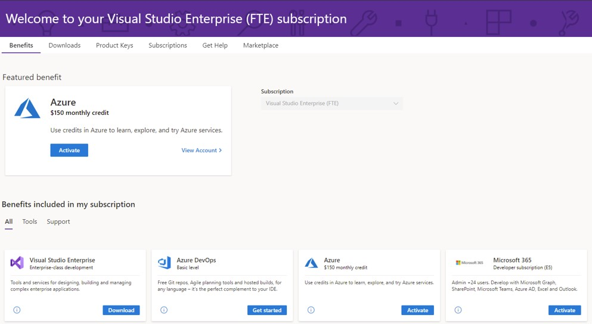

# Teilnehmen am Microsoft 365-Entwicklerprogramm mit einem Visual Studio Professional- oder Enterprise-Abonnement

Alle neuen Mitglieder des Microsoft 365-Entwicklerprogramms (einschließlich Visual Studio Professional- und Enterprise-Abonnenten) können sich für ein Microsoft 365 E5-Entwicklerabonnement registrieren (Windows nicht inbegriffen). 

Ausgewählte Visual Studio Professional- oder Enterprise-Standardabonnements beinhalten den Zugriff auf die Vorteile des Microsoft 365-Entwicklerabonnements, solange die Abonnements aktiv sind. Ihr kostenpflichtiges Visual Studio Professional- oder Enterprise-Abonnement gewährt Ihnen ein kostenloses, erneuerbares Microsoft 365-Entwicklerabonnement mit bis zu 25 Benutzern. Dies kann hilfreich sein, wenn Sie einen eigenen Sandkasten außerhalb Ihrer Unternehmensdomäne zu Entwicklungs- und Testzwecken erstellen möchten.

Dadurch erhalten Sie auch einen speziellen Status im Microsoft 365-Entwicklerprogramm. Ihr Abonnement wird automatisch verlängert, solange Sie über ein gültiges Visual Studio Professional- oder Enterprise-Abonnement verfügen.

## Wie erhalte ich ein erneuerbares Microsoft 365-Entwicklerabonnement?

Wenn Sie über kein Visual Studio Professional- oder Enterprise-Abonnement verfügen und eines wünschen, sehen Sie sich die Seite [Visual Studio-Abonnement](https://visualstudio.microsoft.com/vs/pricing/) an.

Wenn Sie bereits über ein Visual Studio Professional- oder Enterprise-Abonnement verfügen, können Sie ein Microsoft 365-Entwicklerabonnement über Ihr Visual Studio-Abonnentenportal erhalten. Wechseln Sie zu [https://my.visualstudio.com](https://my.visualstudio.com), und klicken Sie auf die Kachel **Microsoft 365-Entwicklerabonnement (E5)**. Dadurch treten Sie automatisch dem Microsoft 365-Entwicklerprogramm mit Ihrer Visual Studio-ID bei.

## Was ist der Unterschied zwischen dem direkten Beitritt zum Programm und dem Beitritt über mein Visual Studio-Abonnement?

Wenn Sie dem Microsoft 365-Entwicklerprogramm mit Ihrem Visual Studio-Abonnement beitreten, wird Ihr Microsoft 365 E5-Entwickler-Sandkastenabonnement für die Dauer Ihres Visual Studio-Abonnements automatisch verlängert. 

Wenn Sie dem Entwicklerprogramm direkt beitreten, wird Ihr Microsoft 365 E5-Entwickler-Sandkastenabonnement basierend auf Ihrer Entwicklungsaktivität alle 90 Tage verlängert. Weitere Informationen finden Sie unter [Ablauf und Verlängerung von Abonnements](subscription-expiration-and-renewal.md).