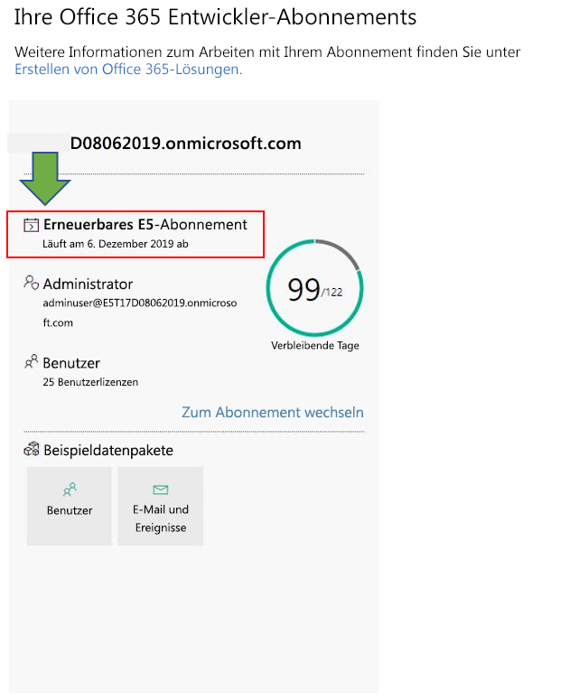
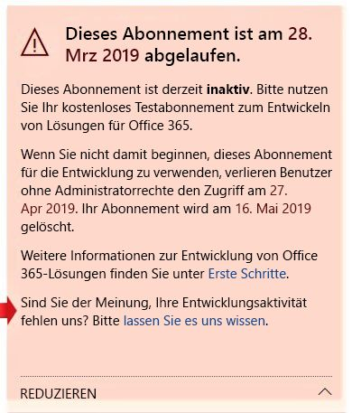

# Häufig gestellte Fragen zum Microsoft 365-EntwicklerprogrammMicrosoft 365 Developer Program FAQ

Nachfolgend finden Sie häufig gestellte Fragen zum Microsoft 365-Entwicklerprogramm.The following are frequently asked questions about the Microsoft 365 Developer Program.

## Was ist das Microsoft 365-Entwicklerprogramm und wer sollte ihm beitreten?What is the Microsoft 365 Developer Program and who should join it?

Das Microsoft 365-Entwicklerprogramm wurde entwickelt, um Ihnen zu helfen, menschenorientierte, plattformübergreifende Produktivitätsumgebungen zu schaffen, die Microsoft 365 erweitern.The Microsoft 365 Developer Program is designed to help you build people-centric, cross-platform productivity experiences that extend Microsoft 365. Treten Sie unserem Programm bei, um Zugang zu den benötigten Tools, Dokumentation, Schulungen, Experten und Communityereignissen zu erhalten, um großartige Lösungen für Microsoft 365-Produkte und -Technologien zu entwickeln, einschließlich:Join our program to get access to the tools, documentation, training, experts, and community events that you need to build great solutions for Microsoft 365 products and technologies, including:

- [Excel](https://developer.microsoft.com/excel)-, [Outlook](https://developer.microsoft.com/outlook)-, [Word](https://developer.microsoft.com/word)- und [PowerPoint](https://developer.microsoft.com/powerpoint)-Web-Add-Ins[Excel](https://developer.microsoft.com/excel), [Outlook](https://developer.microsoft.com/outlook), [Word](https://developer.microsoft.com/word), and [PowerPoint](https://developer.microsoft.com/powerpoint) web add-ins
- [SharePointSharePoint](https://developer.microsoft.com/sharepoint)
- [Microsoft TeamsMicrosoft Teams](https://developer.microsoft.com/microsoft-teams)
- [Microsoft GraphMicrosoft Graph](https://developer.microsoft.com/graph)

Als Teilnehmer des Programms erhalten Sie ein kostenloses Microsoft 365-Entwicklerabonnement mit 25 Benutzerlizenzen erhalten, die Sie zum Erstellen Ihrer Lösungen verwenden können.As a program member, you can get a free Microsoft 365 developer subscription with 25 user licenses to use to build your solutions. Dieses Abonnement bleibt so lange aktiv, wie Sie aktiv Lösungen entwickeln und bereitstellen.This subscription will remain active for as long as you’re actively developing and deploying solutions.

Weitere Informationen finden Sie unter [Treten Sie dem Microsoft 365-Entwicklerprogramm bei](microsoft-365-developer-program.md) und [Erstellen von Microsoft 365-Lösungen](build-microsoft-365-solutions.md).For more information, see [Join the Microsoft 365 Developer Program](microsoft-365-developer-program.md) and [Build Microsoft 365 solutions](build-microsoft-365-solutions.md).

## Welches Konto kann ich verwenden, um mich für das Microsoft 365-Entwicklerprogramm anzumelden?What account can I use to sign up for the Microsoft 365 Developer Program?

Sie können sich mit einem der folgenden Kontotypen für das Entwicklerprogramm registrieren:You can sign up for the developer program by using one of the following account types:

- **Microsoft-Konto** (von Ihnen für private Zwecke erstellt) – Ermöglicht Zugriff auf alle Microsoft-Produkte und Clouddienste, z. B. Outlook (Hotmail), Messenger, OneDrive, MSN, Xbox Live oder Microsoft 365.**Microsoft account** (created by you for personal use) - Provides access to all consumer-oriented Microsoft products and cloud services, such as Outlook (Hotmail), Messenger, OneDrive, MSN, Xbox Live, or Microsoft 365. Durch Registrieren für ein Outlook.com-Postfach wird automatisch ein Microsoft-Konto erstellt.Signing up for an Outlook.com mailbox automatically creates a Microsoft account. Nachdem ein Microsoft-Konto erstellt wurde, kann es verwendet werden, um auf Microsoft Cloud-Dienste oder Azure für Verbraucher zuzugreifen.After a Microsoft account is created, it can be used to access consumer-related Microsoft cloud services or Azure. 
- **Geschäftskonto** (wird von einem Administrator für geschäftliche Zwecke ausgegeben) – Ermöglicht Zugriff auf Microsoft Cloud Services für kleine, mittelständische und große Unternehmen, z. B. Azure, Microsoft Intune oder Microsoft 365.**Work account** (issued by an admin for business use) - Provides access to all small, medium, and enterprise business-level Microsoft cloud services, such as Azure, Microsoft Intune, or Microsoft 365. Wenn Sie für einen dieser Dienste als Organisation registrieren, wird automatisch ein cloudbasiertes Verzeichnis in Azure Active Directory zur Darstellung bereitgestellt, das für Ihre Organisation steht.When you sign up to one of these services as an organization, a cloud-based directory is automatically provisioned in Azure Active Directory to represent your organization. Weitere Informationen finden Sie unter [Verwalten Ihres Azure AD-Verzeichnisses](/azure/active-directory/active-directory-administer).For more information, see [Manage your Azure AD directory](/azure/active-directory/active-directory-administer).
- **Visual Studio-ID** (erstellt für Ihr Visual Studio Professional- oder Visual Studio Enterprise-Abonnement) – Wir empfehlen, diese Option zu verwenden, um dem Entwicklerprogramm über Visual Studio Gallery beizutreten und von den kompletten Vorteilen als Visual Studio-Abonnent zu profitieren.**Visual Studio ID** (created for your Visual Studio Professional or Enterprise subscriptions) - We recommend that you use this option to join the developer program from within the Visual Studio Gallery to get the full benefits as a Visual Studio subscriber. 

## Wie erhalte ich ein Microsoft 365 Developer-Abonnement über das Entwicklerprogramm?How can I get a Microsoft 365 developer subscription via the Developer Program?  

Wenn Sie am Microsoft 365-Entwicklerprogramm teilnehmen, können Sie ein kostenloses Microsoft 365 E5-Entwicklerabonnement erhalten.When you join the Microsoft 365 Developer Program, you qualify to get a free Microsoft 365 E5 developer subscription. Dabei handelt es sich um ein spezielles Abonnement, das nur für Anwendungsentwicklung entwickelt wurde.This is a special subscription designed to be used for application development only. Weitere Informationen finden Sie unter [Einrichten eines Microsoft 365 Developer-Abonnements](microsoft-365-developer-program-get-started.md).For more information, see [Set up a Microsoft 365 developer subscription](microsoft-365-developer-program-get-started.md).

## Welche ID verwende ich, um mich beim Dashboard des Entwicklerprogramms anzumelden.What ID do I use to sign in to the Developer Program dashboard?

Melden Sie sich mit Ihrer Mitglieds-ID beim Dashboard des Entwicklerprogramms an, um auf Informationen zu Ihrem Abonnement zuzugreifen.Use your member ID to sign in to the Developer Program dashboard to access information about your subscription. Hierbei handelt es sich um das Microsoft-Konto oder die Azure Active Directory-E-Mail, mit dem/der Sie sich beim Beitritt zum Programm angemeldet haben.This is the Microsoft account or Azure Active Directory-enabled email that you used to sign in when you joined the program.

## Welche ID verwende ich für die Anmeldung bei meinem Entwicklerabonnement?What ID do I use to sign in to my developer subscription?

Verwenden Sie die Administrator-ID, die Sie beim Einrichten Ihres Entwicklerabonnements erstellt haben.Use the administrator ID that you created when you set up your developer subscription. Ihre Administrator-ID finden Sie auf der Kachel "Abonnement" im [Dashboard des Entwicklerprogramms](https://aka.ms/DevProgramDashboard).You can find your administrator ID on the subscription tile on the [Developer Program dashboard](https://aka.ms/DevProgramDashboard).

## Was ist im Entwicklerabonnement enthalten?What's included in the developer subscription?

Wenn Sie Ihr Abonnement nach dem 25. August 2019 abgeschlossen haben, verfügen Sie über ein Microsoft 365 E5-Entwicklerabonnement mit 25 Benutzerlizenzen.If you created your subscription after August 25, 2019, you have a Microsoft 365 E5 Developer subscription with 25 user licenses. Kunden, die dem Programm vor dem 25. August 2019 beigetreten sind, haben ein Office 365 E3-Entwicklerabonnement mit 25 Benutzerlizenzen.Customers who joined the program before August 25, 2019, have an Office 365 E3 Developer subscription with 25 user licenses.

Das Office 365 E3-Entwicklerabonnement umfasst Folgendes:The Office 365 E3 Developer subscription includes the following:

- [Exchange Online (Plan 2)Exchange Online (Plan 2)](https://products.office.com/exchange/compare-microsoft-exchange-online-plans)
- [Microsoft Flow für Office 365Flow for Office 365](https://flow.microsoft.com/pricing/)
- [Information Protection für Office 365 – StandardInformation Protection for Office 365 - Standard](https://products.office.com/de-DE/business/azure-information-protection-for-office-365)
- [Microsoft Forms (Plan E5)Microsoft Forms (Plan E5)](https://support.office.com/article/Frequently-asked-questions-about-Microsoft-Forms-495c4242-6102-40a0-add8-df05ed6af61c)
- [Microsoft PlannerMicrosoft Planner](https://products.office.com/compare-all-microsoft-office-products?tab=2)
- 
  [Microsoft Search](https://products.office.com/en-us/business/intelligent-search?tab=Discovery)[Microsoft Search](https://products.office.com/en-us/business/intelligent-search?tab=Discovery)
- [Microsoft Stream für Office 365 E5 SKUMicrosoft Stream for Office 365 E5 SKU](https://products.office.com/business/office-365-enterprise-e5-business-software)
- [Microsoft TeamsMicrosoft Teams](https://products.office.com/business/office-365-enterprise-e5-business-software)
- [Verwaltung mobiler Geräte in Office 365Mobile Device Management for Office 365](https://support.office.com/article/Set-up-Mobile-Device-Management-MDM-in-Office-365-dd892318-bc44-4eb1-af00-9db5430be3cd)
- [Office 365 ProPlusOffice 365 ProPlus](https://products.office.com/business/office-365-proplus-business-software)
- [Office für das WebOffice for the web](/office365/servicedescriptions/office-online-service-description/office-online-service-description)
- [PowerApps für Office 365PowerApps for Office 365](https://powerapps.microsoft.com/pricing/)
- [SharePoint Online für EntwicklerSharePoint Online for Developer](https://products.office.com/SharePoint/compare-sharepoint-plans)
- [Skype for Business Online Plan 2Skype for Business Online (Plan 2)](https://products.office.com/skype-for-business/online-meeting-solutions)
- [SwaySway](https://sway.com/)
- [To-do (Plan 3)To-Do (Plan 3)](https://todo.microsoft.com)
- [Whiteboard (Plan 2)Whiteboard (Plan 2)](https://products.office.com/de-DE/microsoft-whiteboard/digital-whiteboard-app)

Das Microsoft 365 E5-Entwicklerabonnement enthält alle Apps, die im Office 365 E3-Entwicklerabonnement enthalten sind, sowie die folgenden neuen Funktionen:The Microsoft 365 E5 Developer subscription includes all the apps that are included in the Office 365 E3 Developer subscription, plus the following new features:  

- Fortschrittliche Analysefunktionen mit Power BIAdvanced analytics with Power BI  
- Enterprise Mobility + Security (EMS) für Compliance und InformationsschutzEnterprise Mobility + Security (EMS) for compliance and information protection  
- Office 365 Advanced Threat ProtectionOffice 365 Advanced Threat Protection 
- Azure Active Directory für den Aufbau erweiterter Identitäts-und ZugriffsverwaltungslösungenAzure Active Directory for building advanced identity and access management solutions  

Das Microsoft 365 E5-Entwicklerabonnement umfasst Folgendes:The Microsoft 365 E5 Developer subscription includes the following: 

- Azure Active Directory Premium P1Azure Active Directory Premium P1 
- Azure Active Directory Premium P2Azure Active Directory Premium P2 
-   Azure Advanced Threat ProtectionAzure Advanced Threat Protection 
-   Azure Information Protection Premium P1Azure Information Protection Premium P1 
-   Azure Information Protection Premium P2Azure Information Protection Premium P2 
-   Kunden-LockboxCustomer Lockbox 
-   Exchange Online (Plan 2)Exchange Online (Plan 2) 
-   Microsoft Flow für Office 365Flow for Office 365 
-   Information Protection für Office 365 – PremiumInformation Protection for Office 365 - Premium 
-   Information Protection für Office 365 – StandardInformation Protection for Office 365 - Standard 
-   Microsoft Azure Active Directory-RechteMicrosoft Azure Active Directory Rights 
-   Microsoft Azure Multi-Factor AuthenticationMicrosoft Azure Multi-Factor Authentication 
-   Microsoft Cloud App SecurityMicrosoft Cloud App Security 
-   Microsoft Forms (Plan E5)Microsoft Forms (Plan E5) 
-   Microsoft IntuneMicrosoft Intune 
-   Microsoft MyAnalytics (Vollversion)Microsoft MyAnalytics (Full) 
-   Microsoft PlannerMicrosoft Planner 
-   Microsoft StaffHubMicrosoft StaffHub 
-   Microsoft Stream für Office 365 E5 SKUMicrosoft Stream for O365 E5 SKU 
-   Microsoft TeamsMicrosoft Teams 
-   Verwaltung mobiler Geräte für Office 365Mobile Device Management for Office 365 
-   Office 365 Advanced eDiscoveryOffice 365 Advanced eDiscovery 
-   Office 365 Advanced Security ManagementOffice 365 Advanced Security Management 
-   Office 365 Advanced Threat Protection (Plan 1)Office 365 Advanced Threat Protection (Plan 1) 
-   Office 365 Advanced Threat Protection (Plan 2)Office 365 Advanced Threat Protection (Plan 2) 
-   Office 365 Privileged Access ManagementOffice 365 Privileged Access Management 
-   Office 365 ProPlusOffice 365 ProPlus 
-   Office OnlineOffice Online 
-   TelefonsystemPhone System 
-   Power BI ProPower BI Pro 
-   PowerApps für Office 365 Plan 3PowerApps for Office 365 Plan 3 
-   SharePoint Online (Plan 2)SharePoint Online (Plan 2) 
-   Skype for Business Online (Plan 2)Skype for Business Online (Plan 2) 
-   SwaySway 
-   To-Do (Plan 3)To-Do (Plan 3) 
-   Whiteboard (Plan 3)Whiteboard (Plan 3) 
-   Yammer EnterpriseYammer Enterprise 

Ob Sie über ein Microsoft 365 E5-Abonnement oder ein Office 365 E3-Abonnement verfügen, können Sie auf der Abonnementkachel auf Ihrem [Dashboard](https://developer.microsoft.com/office/profile) feststellen.You can determine whether you have a Microsoft 365 E5 subscription or an Office 365 E3 subscription on the subscription tile on your [dashboard](https://developer.microsoft.com/office/profile). Auf der Kachel wird unterhalb des Domänennamens des Abonnements entweder E3 oder E5 angezeigt.The tile will show either E3 or E5 under the subscription domain name.

..

## Umfasst das Abonnement auch ein Abonnement für Azure?Does the subscription also include a subscription to Azure?

Dieses Angebot schließt kein Abonnement für Azure ein.This offer does not include a subscription to Azure. Um aber kostenlosen Zugriff auf Azure-Dienste zu erhalten, können Sie [ein kostenloses Azure-Konto erstellen](https://azure.microsoft.com/free/).However, to receive free access to Azure services, you can [create a free Azure account](https://azure.microsoft.com/free/). 

## Wie viele Benutzerlizenzen enthält das Entwicklerabonnement?How many user licenses does the developer subscription include?

Ihr Office 365 E3- oder Microsoft 365 E5-Entwicklerabonnement enthält 25 Benutzerlizenzen (einschließlich des Administrators) nur für Entwicklungszwecke.Your Office 365 E3 or Microsoft 365 E5 developer subscription includes 25 user licenses, including the administrator, for development purposes only. Die Verwendung dieses Abonnements für andere Zwecke als die Anwendungsentwicklung ist ein Verstoß gegen die Lizenzvereinbarung.Using this subscription for any purpose other than application development is a violation of the license agreement. Weitere Informationen über die Lizenzeinschränkungen finden Sie unter [Nutzungsbedingungen](terms-and-conditions.md).For more details about the licensing restrictions, see the [terms of use](terms-and-conditions.md).

## Wie lange ist mein Abonnement gültig und wann läuft es ab?How long is my subscription good for, and when does it expire?

Ihr Abonnement ist 90 Tage gültig und verlängerbar, basierend auf gültiger Entwickleraktivität.Your subscription is good for 90 days and is renewable based on valid developer activity. Wenn Sie Ihr Abonnement für die Entwicklung verwenden, wird es alle 3 Monate verlängert und ist unbegrenzt verfügbar.If you're using your subscription for development, it will be renewed every 3 months and will last indefinitely. Das Ablaufdatum, zusammen mit dem Abonnementnamen, finden Sie im [Dashboard des Microsoft 365-Entwicklerprogramms](https://aka.ms/DevProgramDashboard).You can find the expiration date, along with your subscription name, on your [Microsoft 365 Developer Program dashboard](https://aka.ms/DevProgramDashboard). Weitere Informationen finden Sie unter [Ablauf und Verlängerung für das Abonnement](subscription-expiration-and-renewal.md).For more information, see [Subscription expiration and renewal](subscription-expiration-and-renewal.md).

Wenn Sie dem Programm über Visual Studio Enterprise oder Visual Studio Professional beitreten, wird Ihr Abonnement automatisch verlängert, bis Ihr Visual Studio-Abonnement abläuft.If you're joining the program through Visual Studio Enterprise or Visual Studio Professional, your subscription is automatically renewed until your Visual Studio subscription expires. 

## Warum bieten Sie kein 1-Jahres-Abonnement an?Why don’t you offer a one-year subscription?

Im April 2019 haben wir zu einem neuen Modell gewechselt, bei dem Ihr Abonnement alle 90 Tage erneuert werden kann, wenn Sie es aktiv für die Entwicklung nutzen.In April 2019, we transitioned to a new model where your subscription can be renewed perpetually every 90 days if you're actively using it for development. Wir sind der Meinung, dass dieses Modell sicherstellt, dass Entwicklern, die aktiv Lösungen entwickeln, ein Abonnement zur Verfügung steht, solange sie es benötigen.We believe that this model ensures that developers who are actively developing solutions have a subscription for as long as they need one. Wenn Sie häufig entwickeln, läuft Ihr Abonnement nie ab; es wird automatisch verlängert.If you're developing frequently, your subscription never expires; it is automatically extended. Wenn Sie für kurze Zeit entwickeln und Ihr Abonnement abläuft und gelöscht wird, können Sie sich für ein neues Abonnement anmelden.If you're developing for a short time, and your subscription expires and is deleted, you can sign up for a new one. 

Wenn Sie ein Abonnement bevorzugen, das für eine längere Zeit verfügbar ist, empfehlen wir Ihnen, das Abonnement für Visual Studio Professional oder Visual Studio Enterprise zu erwerben.If you prefer to have a subscription that is available for a longer time, we recommend that you get the Visual Studio Professional or Visual Studio Enterprise subscription. Diese Programme enthalten ein kostenloses Microsoft 365 Developer-Abonnement, das für die Dauer Ihres Visual Studio-Abonnements gültig ist.These programs include a free Microsoft 365 developer subscription that is good for the life of your Visual Studio subscription. Um darauf zuzugreifen, navigieren Sie zu [Visual Studio | Meine Vorteile ](https://my.visualstudio.com/benefits).To access this, go to [Visual Studio | My Benefits](https://my.visualstudio.com/benefits). Weitere Informationen erhalten Sie unter [Visual Studio-Kundendienst](https://www.visualstudio.com/subscriptions/support/).For more information, contact [Visual Studio customer service](https://www.visualstudio.com/subscriptions/support/). 

## Wie stellen Sie fest, ob ein Abonnement verlängert werden kann?How do you determine whether a subscription can be renewed?

Wir verwenden eine Reihe von Algorithmen und Telemetrie, die wir aus Ihrer Tätigkeit im Microsoft 365-Entwicklerprogramm und in Ihrem Office 365 E3- oder Microsoft 365 E5-Entwicklerabonnement erhalten, um zu ermitteln, ob Sie aktiv entwickeln.We use a set of algorithms and telemetry that we get from your activity in the Microsoft 365 Developer Program and on your Office 365 E3 or Microsoft 365 E5 developer subscription to determine whether you are actively developing. Wir überprüfen diese regelmäßig, um Ihren Status zu aktualisieren und festzustellen, ob Ihr Abonnement verlängert werden sollte.We check these regularly to update your status and determine whether your subscription should be extended. 

Wenn Sie der Meinung sind, dass wir Ihre Entwicklungsaktivitäten aus irgendeinem Grund nicht genau verfolgt haben, können Sie uns dies über Ihr Dashboard mitteilen.If you think we somehow missed tracking your development activity accurately, you can let us know via your dashboard. Um ein Formular einzureichen, das uns mitteilt, wie Sie Ihr Abonnement für die Entwicklung verwenden, wählen Sie in der Dashboard-Warnung den Link **Informieren Sie uns**, wie im folgenden Bild gezeigt.To submit a form that tells us how you are using your subscription for development, in the dashboard warning, choose the **Let us know** link, as shown in the following image. Wir überprüfen Ihre Anforderung und lassen Sie wissen, ob Sie sich für eine Verlängerung qualifizieren.We will review your request and let you know if you qualify for an extension. 

 

## Wie definieren Sie Entwicklungsaktivität?How do you define development activity?

Ihre Aktivitäten im Entwicklerprogramm und in Ihrem Entwicklerabonnement bestimmen, ob Sie aktiv entwickeln und ob Ihr Abonnement verlängert werden sollte.Your activity in the Developer Program and on your developer subscription determine whether you are actively developing and whether your subscription should be extended. 

Weitere Informationen dazu, welche Arten von Aktivitäten wir verfolgen, finden Sie unter [Nutzungsbedingungen](terms-and-conditions.md).For more information about the types of activities that we track, see the [terms of use](terms-and-conditions.md). 

## Kann ich mein Abonnement verlängern, wenn es bald abläuft?When my subscription is about to expire, can I extend it?

Die einzige Möglichkeit, Ihr Abonnement zu verlängern, besteht darin, gültige Entwickleraktivitäten durchzuführen.The only way that you can extend your subscription is to do valid developer activity. Wenn Sie Ihr Abonnement zur Entwicklung benutzerdefinierter Lösungen verwenden, läuft Ihr Abonnement ab und wird schließlich gelöscht.If you're using your subscription to develop custom solutions, your subscription will expire and will eventually be deleted. 

Weitere Informationen finden Sie unter [Ablauf und Verlängerung für das Abonnement](subscription-expiration-and-renewal.md).For more information, see [Subscription expiration and renewal](subscription-expiration-and-renewal.md).

## Wenn mein Abonnement abläuft, wie viel Zeit habe ich, bevor es gelöscht wird?If my subscription is going to expire, how much time do I have before it is deleted?

Nachdem Ihr Abonnement abgelaufen ist, haben Sie 30 Tage Zeit, Ihre Daten zu migrieren.You have 30 days after your subscription expires to migrate any data. Für die nächsten 30 Tage hat nur der Administrator Zugriff auf das Abonnement, und am 60. Tag werden das Abonnement und alle Daten gelöscht.For the next 30 days, only the admin will have access to the subscription, and on day 60, the subscription and all data will be deleted.

## Wie kann ich von einem Office 365 E3-Abonnement zu einem Microsoft 365 E5-Abonnement migrieren?How can I migrate from an Office 365 E3 subscription to a Microsoft 365 E5 subscription?

Aktuell erhalten nur neue Mitglieder des Microsoft 365-Entwicklerprogramms automatisch ein Microsoft 365 E5-Entwicklerabonnement.Currently, only new Microsoft 365 Developer Program members will get a Microsoft 365 E5 Developer subscription automatically. Bestehenden Benutzern wird künftig eine Möglichkeit für die Migration zu einem Microsoft 365 E5-Entwicklerabonnement angeboten.Existing users will be offered a way to migrate to a Microsoft 365 E5 subscription in the future. Seien Sie versichert: Wir arbeiten daran, allen Mitglieder des Office 365-Entwicklerprogramms zu ermöglichen, zu Microsoft 365 E5 zu migrieren.Rest assured, we are working to enable all Office 365 Developer Program members to migrate to Microsoft 365 E5. 

## Kann ich mich zwischen einem Office 365 E3- oder einem Microsoft 365 E5-Abonnement entscheiden?Can I choose whether to have an Office 365 E3 or a Microsoft 365 E5 subscription?

Derzeit wird nur neuen Mitgliedern des Entwicklerprogramms ein Microsoft 365 E5-Abonnement angeboten.Currently, only new Developer Program members are offered a Microsoft 365 E5 subscription. Bestehende Mitglieder mit einem Office 365 E3-Abonnement haben die Möglichkeit, ihr aktuelles Abonnement zu behalten und es weiter zu verlängern, wenn sie die neuen Funktionen von Microsoft 365 E5 nicht benötigen.Existing members with an Office 365 E3 subscription will have the option to keep their current subscription and continue to renew it if they don't need the new capabilities offered in Microsoft 365 E5. Mitglieder des Entwicklerprogramms können nur ein Abonnement haben.Developer program members can only have one subscription.  

Sobald eine Migrationsoption für bestehende Mitglieder des Entwicklerprogramms besteht, werden wir weitere Informationen zum Migrieren bereitstellen.When we have a migration option for existing Developer Program members, we’ll provide more information about how to migrate. 

## Kann ich als Microsoft-Partner ein Abonnement erhalten?As a Microsoft Partner, can I receive a subscription? 

Ja, Sie können die [folgenden Anweisungen](microsoft-365-developer-program.md) befolgen, um am Microsoft 365-Entwicklerprogramm teilzunehmen und ein Microsoft 365 Developer-Abonnement einzurichten.Yes, you can follow [these instructions](microsoft-365-developer-program.md) to join the Microsoft 365 Developer Program and set up a Microsoft 365 developer subscription. Wenn Sie jedoch bereits über ein Abonnement von Visual Studio Enterprise oder Visual Studio Professional verfügen, können Sie zusätzlich ein Microsoft 365-Entwicklerabonnement erhalten.However, if you already have a Visual Studio Enterprise or Visual Studio Professional subscription, you can get a Microsoft 365 developer subscription as a benefit. Um darauf zuzugreifen, navigieren Sie zu [Visual Studio | Meine Vorteile ](https://my.visualstudio.com/benefits).To access this, go to [Visual Studio | My Benefits](https://my.visualstudio.com/benefits). Weitere Informationen erhalten Sie unter [Visual Studio-Kundendienst](https://www.visualstudio.com/subscriptions/support/).For more information, contact [Visual Studio customer service](https://www.visualstudio.com/subscriptions/support/). 

## Kann ich als Vollzeitmitarbeiter von Microsoft ein Abonnement erhalten?As a full-time Microsoft employee, can I receive a subscription?

Microsoft-Mitarbeiter können sich nicht für dieses Angebot registrieren.Microsoft employees cannot sign up for this offer. Alle Vollzeitmitarbeiter von Microsoft haben Zugriff auf ein kostenloses Visual Studio-Abonnement, das den Zugriff auf ein Microsoft 365 E5-Entwicklerabonnement umfasst.All Microsoft full-time employees have access to a free Visual Studio subscription that includes access to a Microsoft 365 E5 developer subscription. Sie können unter [Visual Studio | Meine Angebote](https://my.visualstudio.com/benefits) auf dieses Angebot zugreifen.You can access this benefit at [Visual Studio | My Benefits](https://my.visualstudio.com/benefits).

## Komme ich als Anbieter bei Microsoft für ein Abonnement in Frage?As a vendor working at Microsoft, do I qualify for a subscription?

Ja, Sie können die [folgenden Anweisungen](microsoft-365-developer-program.md) befolgen, um am Microsoft 365-Entwicklerprogramm teilzunehmen und ein Microsoft 365 Developer-Abonnement einzurichten.Yes, you can follow [these instructions](microsoft-365-developer-program.md) to join the Microsoft 365 Developer Program and set up a Microsoft 365 developer subscription. Aber auch für Anbieter ist dieses Abonnement so konzipiert, dass es _nur für die Anwendungsentwicklung_ verwendet werden kann.But even for vendors, this subscription is designed to be used _for application development only_. Wenn Sie keine gültigen Entwicklungsaktivitäten durchführen, wird Ihr Abonnement nicht verlängert.If you are not doing valid development activity, your subscription will not be renewed.

## Ist das Microsoft 365-Entwicklerprogramm in meiner Sprache verfügbar?Is the Microsoft 365 Developer Program available in my language?

Neben Englisch ist das Microsoft 365-Entwicklerprogramm in den folgenden Sprachen verfügbar: Chinesisch (vereinfacht), Deutsch, Französisch, Japanisch, Portugiesisch (Brasilien), Russisch und Spanisch.In addition to English, the Microsoft 365 Developer Program is available in the following languages: Chinese (Simplified), French, German, Japanese, Portuguese (Brazil), Russian, and Spanish.

## Ist das Microsoft 365 Developer-Abonnement in meiner Sprache verfügbar?Is the Microsoft 365 developer subscription available in my language?

Das Microsoft 365-Entwicklerabonnement wird nur auf Englisch angeboten.The Microsoft 365 developer subscription is only offered in English.

## Wie kann ich das Microsoft 365-Entwicklerprogramm verlassen?How do I leave the Microsoft 365 Developer Program?

Wenn Sie beschließen, dass Sie nicht mehr am Microsoft 365-Entwicklerprogramm teilnehmen möchten, können Sie Ihr Abonnement beenden und das Programm verlassen.If you decide that you no longer want to participate in the Microsoft 365 Developer Program, you can end your subscription and leave the program.

  > [!WARNING]
  > Mit den folgenden Schritten werden Ihre gesamten Profilinformationen gelöscht.The following steps will erase all of your profile information. Es werden alle in Ihrem Entwicklerprogramm gespeicherten Daten gelöscht, die nicht an anderer Stelle gesichert sind.You will lose any data stored in your developer subscription that is not backed up elsewhere.

1. Melden Sie sich beim Microsoft 365-Entwicklerprogramm an.Sign in to the Microsoft 365 Developer Program.

2. Wählen Sie **Profil löschen** aus.Choose **Delete Profile**.

3. Wählen Sie im Bestätigungsfeld **Profil löschen** die Option **Löschen** aus.In the **Delete Profile** confirmation box, choose **Delete**.

## SupportSupport

Wenn Sie Probleme beim Einrichten Ihres Abonnements haben, sehen Sie sich die folgenden Supportressourcen an:If you have issues setting up your subscription, see the following support resources:

- [Stack OverflowStack Overflow](https://stackoverflow.com/questions)   
- [Visual Studio-KundendienstVisual Studio customer service](https://www.visualstudio.com/subscriptions/support/)

## Weitere ArtikelSee also

- [Teilnehmen am Microsoft 365-EntwicklerprogrammJoin the Microsoft 365 Developer Program](microsoft-365-developer-program.md)
- [Einrichten eines Microsoft 365 Developer-AbonnementsSet up a Microsoft 365 developer subscription](microsoft-365-developer-program-get-started.md)
- [Verwenden Ihres Abonnements zum Erstellen von Microsoft 365-LösungenUse your subscription to build Microsoft 365 solutions](build-microsoft-365-solutions.md)
- [Verlängern eines ablaufenden AbonnementsRenew an expiring subscription](subscription-expiration-and-renewal.md)

 

 

 

 

 

 
