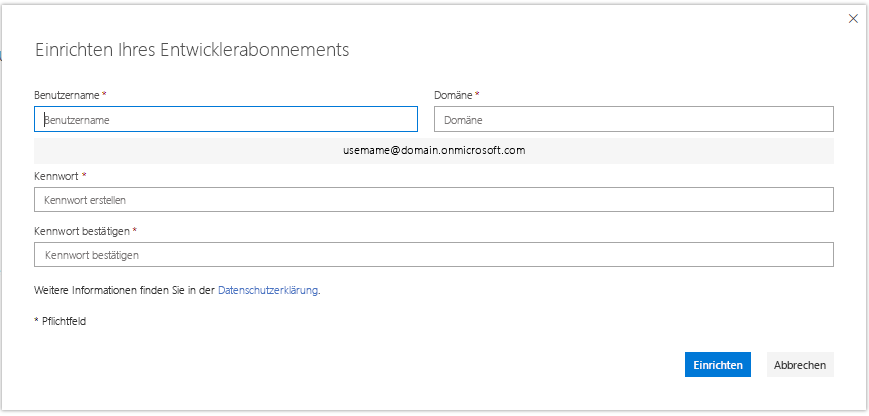

# Einrichten eines Microsoft 365-Entwickler-Sandboxabonnements 

Richten Sie ein Microsoft 365-Entwicklerabonnement ein, um unabhängig von Ihrer Produktionsumgebung Lösungen zu entwickeln. Das Abonnement ist ein Microsoft 365 E5-Entwicklerabonnement mit 25 Benutzerlizenzen. Es gilt für 90 Tage und kann ausschließlich für Entwicklungszwecke (Codierung von Lösungen) kostenlos verwendet werden. 

> [!NOTE] 
> Zum Einrichten eines Abonnements müssen Sie zuerst direkt oder über Visual Studio Professional oder Enterprise (wenn Sie Abonnent sind) [am Microsoft 365-Entwicklerprogramm teilnehmen](microsoft-365-developer-program.md). Danach haben Sie die Möglichkeit, ein Abonnement einzurichten.

## Einrichten Ihres Microsoft 365 E5-Sandboxabonnements

1. Wenn Sie ein Microsoft 365 Developer-Abonnement abschließen möchten, wählen Sie auf Ihrer Profilseite **Abonnement einrichten** aus.

2. Erstellen Sie im Dialogfeld **Einrichten Ihres Entwicklerabonnements** einen Benutzernamen und eine Domäne. Dieses Konto muss globale Administratorberechtigungen für das Abonnement besitzen. Sie können einen beliebigen Benutzer- und Domänennamen verwenden, sofern dieser nichts bereits verwendet wird. Verwenden Sie keine Leerzeichen.

  

3. Erstellen und bestätigen Sie ein Kennwort.

4. Wählen Sie **Einrichten** aus.

5. Wenn Sie aufgefordert werden, zu bestätigen, dass Sie kein Roboter sind, folgen Sie den Anweisungen, und wählen Sie dann **Überprüfen**.

6. Nachdem das Abonnement erstellt wurde, werden der Abonnementname und das Ablaufdatum auf Ihrer Profilseite angezeigt.

  > [!IMPORTANT]
  > Notieren Sie Ihren Benutzernamen und das Kennwort, da Sie dies für den Zugriff auf Ihr Entwicklerabonnement benötigen.

## Konfigurieren des Abonnements

1. Wählen Sie auf Ihrer Profilseite **Zum Abonnement wechseln** aus, und melden Sie sich mit Ihrer Benutzer-ID (z. B. username@domain.onmicrosoft.com) und dem Kennwort an, das Sie für Ihr Entwicklerabonnement angegeben haben.

   > [!NOTE] 
   > Melden Sie sich bei Ihrem Abonnement nicht mit Ihrer Konto-ID für das Entwicklerprogramm an.

2. Verwenden Sie das App-Startfeld, um zum [Admin Center](https://admin.microsoft.com/AdminPortal/Home#/homepage) zu wechseln.

3. Wählen Sie auf der Admin Center-Startseite die Option **Zu Setup wechseln** aus. Damit gelangen Sie zur Seite **Microsoft 365 E5-Entwickler-Setup**.

4. **Personalisieren Sie Ihre Anmeldung und Ihre E-Mail**. Sie können Ihr Abonnement mit einer Domäne verbinden oder einfach die vorhandene Unterdomäne erstellen, die Sie erstellt haben. Wenn Sie bereit sind, wählen Sie **Weiter**.

5. **Fügen Sie neue Benutzer hinzu**. Sie können fiktive oder echte Benutzer hinzufügen, um die Entwicklung zu erleichtern. Wenn Sie bereit sind, wählen Sie **Weiter**.
    
  > [!NOTE]
  > Nach dem Einrichten Ihres Abonnements können Sie das Beispieldatenpaket "Benutzer" installieren. Das Beispieldatenpaket "Benutzer" erstellt in Ihrem Abonnement 16 Beispielbenutzer, einschließlich der Lizenzen sowie Postfächer, Namen, Metadaten und Fotos für jeden Benutzer. Ausführliche Informationen finden Sie unter [Installieren von Beispieldatenpaketen](install-sample-packs.md).

6. **Zuweisen von Lizenzen zu nicht lizenzierten Benutzer**. Erteilen Sie allen Benutzern, mit denen Sie mit dem Abonnement zusammenarbeiten möchten, eine Lizenz. Wenn Sie bereit sind, wählen Sie **Weiter**.

7. **Freigeben von Anmeldeinformationen**. Sie müssen ihre Anmeldeinformationen für alle realen Benutzer freigeben, die auf das Abonnement zugreifen. Sie können eine Methode auswählen, z. B. E-Mail, Download oder Drucken. Wenn Sie bereit sind, wählen Sie **Weiter**.

8. **Installieren Ihrer Office-Apps**. Sie haben die Möglichkeit, Office-Apps auf Ihrem Computer zu installieren. Wenn Sie bereit sind, wählen Sie **Weiter**.

   > [!TIP] 
   > Bei nachfolgenden Besuchen des Dashboards melden Sie sich mit dem Konto *username@domain*.onmicrosoft.com an, bevor Sie zum Dashboard wechseln.

9. **Sie haben das Ende des Setups erreicht**. Sie haben die Einrichtung Ihres Abonnements abgeschlossen. Optional können Sie Ihre Erfahrung bewerten. Wenn Sie fertig sind, wählen Sie **Zum Admin Center wechseln**.
    
   > [!NOTE] 
   > Derzeit ist die Region des Abonnements standardmäßig auf Nordamerika eingestellt, unabhängig davon, in welchem Land bzw. in welcher Region Sie sich befinden. Sie können Ihr Entwicklerabonnement weiter einrichten und verwenden.

## Bereitstellen von Microsoft 365-Diensten

Es dauert einige Zeit, bis die die Back-End-Dienste wie SharePoint und Exchange für das Abonnement bereitgestellt wurden. Bei diesem Schritt wird für einige Symbole im App-Startfeld und auf der Startseite angezeigt, **dass diese noch eingerichtet werden (bzw. dass die App noch eingerichtet wird)**. Dies dauert nicht länger als eine Stunde.

Wenn die Bereitstellung abgeschlossen ist, können Sie das neue Microsoft 365-Abonnement zum Entwickeln verwenden. Das Abonnement läuft nach 90 Tagen ab. Zum Verlängern lesen Sie [Kann ich mein Abonnement verlängern, wenn es bald abläuft?](microsoft-365-developer-program-faq.yml#renew-subscription)

Wir empfehlen außerdem, dass Sie Release-Optionen aktivieren, um sicherzustellen, dass Sie so bald wie möglich Zugriff auf die neuesten Microsoft 365-Features erhalten. Weitere Informationen finden Sie unter [Einrichten der Standard- oder Targeted Release-Optionen](https://support.office.com/article/set-up-the-standard-or-targeted-release-options-in-office-365-3b3adfa4-1777-4ff0-b606-fb8732101f47).

## Einrichten eines Microsoft Azure-Kontos

Für einige Office-Lösungen benötigen Sie möglicherweise ein Microsoft Azure-Konto zum Erstellen mithilfe von Azure-Diensten. Informationen zum Einrichten eines kostenlosen Azure-Kontos finden Sie unter [Erstellen Sie noch heute Ihr kostenloses Azure-Konto](https://azure.microsoft.com/free/).

## Beispieldatenpakete installieren

Sie können Beispieldatenpakete in Ihrem Abonnement für das Microsoft 365-Entwicklerprogramm installieren. Mit Beispieldatenpaketen sparen Sie Zeit, indem automatisch Daten und Inhalte installiert werden, die Sie zum Erstellen und Testen Ihrer Lösungen benötigen. Dies umfasst Beispielbenutzer, Metadaten und Fotos, um eine kleine Unternehmensumgebung zu simulieren. Ausführliche Informationen zu den verfügbaren Datenpaketen und deren Installation finden Sie unter [Installieren von Beispieldatenpaketen](install-sample-packs.md).

## Weitere Artikel

- [Teilnehmen am Microsoft 365-Entwicklerprogramm](microsoft-365-developer-program.md)
- [Verwenden Ihres Abonnements zum Erstellen von Microsoft 365-Lösungen](build-microsoft-365-solutions.md)
- [Verlängern eines ablaufenden Abonnements](subscription-expiration-and-renewal.md)
- [Häufig gestellte Fragen zum Microsoft 365-Entwicklerprogramm](microsoft-365-developer-program-faq.yml)
