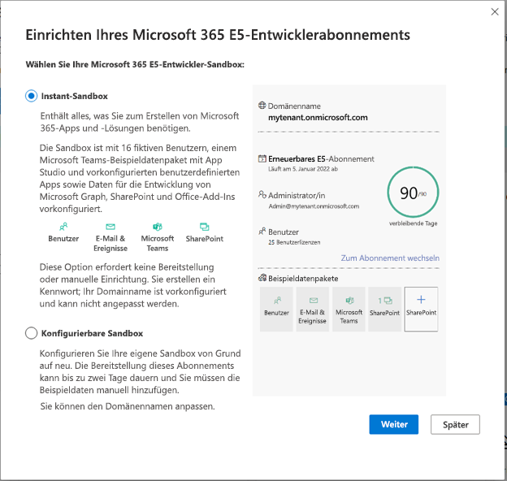

# Einrichten eines Microsoft 365-Entwickler-Sandboxabonnements 

Richten Sie eine Microsoft 365-Entwickler-Sandbox ein, um unabhängig von Ihrer Produktionsumgebung Lösungen zu entwickeln. Ihre Mitgliedschaft im Entwicklerprogramm, dem Sie als reguläres Mitglied oder über Visual Studio Enterprise beitreten, umfasst ein Microsoft 365 E5-Entwickler-Sandboxabonnement mit 25 Benutzerlizenzen. Es gilt für 90 Tage und kann ausschließlich für Entwicklungszwecke (Codierung von Lösungen) kostenlos verwendet werden. 

> [!NOTE] 
> Zum Einrichten eines Abonnements müssen Sie zuerst direkt oder über Visual Studio Professional oder Enterprise (wenn Sie Abonnent sind) [am Microsoft 365-Entwicklerprogramm teilnehmen](microsoft-365-developer-program.md). Danach haben Sie die Möglichkeit, ein Abonnement einzurichten.

Sie können entweder eine Instant-Sandbox oder eine konfigurierbare Sandbox einrichten.

## Instant-Sandbox

Wenn Sie sich für eine Instant-Sandbox entscheiden, können Sie die Konfigurationszeit für Ihre Sandbox von Tagen auf Sekunden verkürzen. Die Instant-Sandbox von Microsoft 365 wird mit Microsoft Teams, SharePoint, Outlook und Office vorab bereitgestellt. Sie umfasst auch Lizenzen für 24 Testbenutzer plus einen Administrator und die aktuellen Microsoft 365-Apps für Ihren PC und Mac, einschließlich Power Apps, Power BI, Enterprise Mobility + Security, Office 365 Advanced Threat Protection und Azure Active Directory.

Darüber hinaus erhalten Sie vorinstallierte Beispieldaten, einschließlich des neuen Teams-Beispieldatenpakets mit Microsoft Graph-Benutzer-, E-Mail- und Kalenderdaten sowie SharePoint-Framework-Beispieldaten. Dieses Paket simuliert eine kleine Unternehmensumgebung, um Sie beim Erstellen von Lösungen auf der Microsoft 365-Plattform zu unterstützen. Ausführliche Informationen finden Sie in den „Beispieldaten zur Entwickler-Sandbox“.

> [!VIDEO https://www.microsoft.com/en-us/videoplayer/embed/RWOmCY]

Sie können Ihren Domänennamen nicht anpassen, wenn Sie diese Option auswählen.

## Konfigurierbare Sandbox

Wenn Sie eine konfigurierbare Sandbox auswählen, können Sie Ihren Domänennamen anpassen. Sie verfügen über eine leere Sandbox, die Sie mit Beispieldaten auffüllen müssen. Die Bereitstellung dieser Sandbox kann bis zu zwei Tage dauern. Sie können die Beispieldatenpakete, die im Dashboard Ihres Entwicklerprogramms verfügbar sind, nach Wahl einzeln installieren. Ausführliche Informationen finden Sie in den „Beispieldaten zur Entwickler-Sandbox“.

## Einrichten Ihres Microsoft 365 E5-Sandboxabonnements

So erhalten Sie ein Microsoft 365-Entwicklerabonnement:

1. Wählen Sie auf Ihrer Profilseite **E5-Abonnement einrichten** aus.

2. Wählen Sie im Dialogfeld **Microsoft 365 E5-Entwicklerabonnement einrichten** aus, ob Sie eine Instant-Sandbox oder eine konfigurierbare Sandbox verwenden möchten, und klicken Sie dann auf **Weiter**.

    

Wenn Sie eine Instant-Sandbox ausgewählt haben:

1.  Wählen Sie das **Land bzw. die Region für Ihr Rechenzentrum** aus, geben Sie einen **Administratorbenutzernamen** und ein **Administratorkennwort** sowie optional ein alternatives Kennwort für Ihre fiktiven Benutzer an, und wählen Sie dann **Weiter** aus.

    > [!IMPORTANT] 
    > Notieren Sie Ihren Benutzernamen und das Kennwort, da Sie dies für den Zugriff auf Ihr Entwicklerabonnement benötigen.

2.  Geben Sie eine gültige Mobiltelefonnummer an, und wählen Sie **Code senden** aus. Geben Sie den Code ein, den Sie erhalten, und klicken Sie dann auf **Einrichten**.

    > [!NOTE] 
    > Sie müssen eine gültige Mobiltelefonnummer verwenden und dürfen nicht über Sprachtelefonie über IP (VoIP) anrufen.

3.  Nachdem das Abonnement erstellt wurde, werden der Domänenname und das Ablaufdatum des Abonnements auf Ihrer Profilseite angezeigt.

Wenn Sie eine konfigurierbare Sandbox ausgewählt haben:

1.  Wählen Sie Ihr **Land bzw. Ihre Region** aus, und geben Sie einen Benutzernamen im Feld **Benutzernamen erstellen** sowie einen Domänennamen im Feld **Domäne erstellen** an. Erstellen und bestätigen Sie Ihr Kennwort, und wählen Sie dann **Weiter** aus.

    > [!IMPORTANT] 
    > Notieren Sie Ihren Benutzernamen und das Kennwort, da Sie dies für den Zugriff auf Ihr Entwicklerabonnement benötigen.

2.  Geben Sie eine gültige Mobiltelefonnummer an, und wählen Sie **Code senden** aus. Geben Sie den Code ein, den Sie erhalten, und klicken Sie dann auf **Einrichten**.
3.  Nachdem das Abonnement erstellt wurde, werden der Domänenname und das Ablaufdatum des Abonnements auf Ihrer Profilseite angezeigt.

## Konfigurieren des Abonnements

1. Wählen Sie auf Ihrer Profilseite **Zum Abonnement wechseln** aus, und melden Sie sich mit Ihrer Benutzer-ID (z. B. username@domain.onmicrosoft.com) und dem Kennwort an, das Sie für Ihr Entwicklerabonnement angegeben haben.

   > [!NOTE] 
   > Melden Sie sich bei Ihrem Abonnement nicht mit Ihrer Konto-ID für das Entwicklerprogramm an.

2. Verwenden Sie das App-Startfeld, um zum [Admin Center](https://admin.microsoft.com/AdminPortal/Home#/homepage) zu wechseln.

3. Wählen Sie auf der Admin Center-Startseite die Option **Zur angeleiteten Einrichtung wechseln** aus. Damit gelangen Sie zur Seite **Microsoft 365 E5-Entwickler-Setup**.

4. **Installieren Ihrer Office-Apps**. Sie haben die Möglichkeit, Office-Apps auf Ihrem Computer zu installieren. Wenn Sie bereit sind, wählen Sie **Weiter** aus.

5. **Personalisieren Sie Ihre Anmeldung und Ihre E-Mail**. Sie können Ihr Abonnement mit einer Domäne verbinden oder einfach die vorhandene Unterdomäne erstellen, die Sie erstellt haben. Wenn Sie bereit sind, wählen Sie **Diese Domäne verwenden** oder **Später erledigen** aus.

6. **Fügen Sie neue Benutzer hinzu**. Sie können fiktive oder echte Benutzer hinzufügen, um die Entwicklung zu erleichtern. Wenn Sie bereit sind, wählen Sie **Benutzer hinzufügen und Lizenzen zuweisen** aus.
    
    > [!NOTE]
    > Wenn Sie über ein konfigurierbares Abonnement verfügen, können Sie nach dem Einrichten Ihres Abonnements das Beispieldatenpaket „Benutzer“ installieren. Das Beispieldatenpaket "Benutzer" erstellt in Ihrem Abonnement 16 Beispielbenutzer, einschließlich der Lizenzen sowie Postfächer, Namen, Metadaten und Fotos für jeden Benutzer. Ausführliche Informationen finden Sie unter [Beispieldaten zur Entwickler-Sandbox](install-sample-packs.md).

6. **Zuweisen von Lizenzen zu nicht lizenzierten Benutzer**. Erteilen Sie allen Benutzern, mit denen Sie mit dem Abonnement zusammenarbeiten möchten, eine Lizenz. Wenn Sie bereit sind, wählen Sie **Benutzer hinzufügen und Lizenzen zuweisen** oder **Später erledigen** aus.

7. **Freigeben von Anmeldeinformationen**. Sie müssen ihre Anmeldeinformationen für alle realen Benutzer freigeben, die auf das Abonnement zugreifen. Sie können eine Methode auswählen, z. B. E-Mail, Download oder Drucken. Wenn Sie bereit sind, wählen Sie **Weiter** aus.

   > [!TIP] 
   > Bei nachfolgenden Besuchen Ihres Dashboards melden Sie sich mit dem Konto *username@domain*.onmicrosoft.com an, bevor Sie zum Dashboard wechseln.

8. Wählen Sie aus, ob Sie Benutzern eine E-Mail über Microsoft Teams senden möchten, und wählen Sie dann **Weiter** aus.

9. **Sie haben das Ende des Setups erreicht**. Sie haben die Einrichtung Ihres Abonnements abgeschlossen. Optional können Sie Ihre Erfahrung bewerten. Wenn Sie fertig sind, wählen Sie **Zum Admin Center wechseln**.
    
   > [!NOTE] 
   > Derzeit ist die Region des Abonnements standardmäßig auf Nordamerika eingestellt, unabhängig davon, in welchem Land bzw. in welcher Region Sie sich befinden. Sie können Ihr Entwicklerabonnement weiter einrichten und verwenden.

## Bereitstellen von Microsoft 365-Diensten in Ihrer konfigurierbaren Sandbox

Wenn Sie über eine konfigurierbare Sandbox verfügen, dauert es einige Zeit, bis die Back-End-Dienste wie SharePoint und Exchange für das Abonnement bereitgestellt wurden. Bei diesem Schritt wird für einige Symbole im App-Startfeld und auf der Startseite angezeigt, **dass diese noch eingerichtet werden (bzw. dass die App noch eingerichtet wird)**. Dies dauert nicht länger als eine Stunde.

Wenn die Bereitstellung abgeschlossen ist, können Sie das neue Microsoft 365-Abonnement zum Entwickeln verwenden. Das Abonnement läuft nach 90 Tagen ab. Zum Verlängern lesen Sie [Kann ich mein Abonnement verlängern, wenn es bald abläuft?](microsoft-365-developer-program-faq.yml#renew-subscription)

Wir empfehlen außerdem, dass Sie Release-Optionen aktivieren, um sicherzustellen, dass Sie so bald wie möglich Zugriff auf die neuesten Microsoft 365-Features erhalten. Weitere Informationen finden Sie unter [Einrichten der Standard- oder Targeted Release-Optionen](https://support.office.com/article/set-up-the-standard-or-targeted-release-options-in-office-365-3b3adfa4-1777-4ff0-b606-fb8732101f47).

## Einrichten eines Microsoft Azure-Kontos

Für einige Office-Lösungen benötigen Sie möglicherweise ein Microsoft Azure-Konto zum Erstellen mithilfe von Azure-Diensten. Dies ist nicht im Microsoft 365 Developer-Abonnement enthalten. Informationen zum Einrichten eines kostenlosen Azure-Kontos finden Sie unter [Erstellen Sie noch heute Ihr kostenloses Azure-Konto](https://azure.microsoft.com/free/).

## Beispieldatenpakete installieren

Sie können Beispieldatenpakete in Ihrer konfigurierbaren Sandbox installieren. Wenn Sie die Instant-Sandbox ausgewählt haben, sind die Beispieldatumspakete vorinstalliert.

Mit Beispieldatenpaketen sparen Sie Zeit, indem automatisch Daten und Inhalte installiert werden, die Sie zum Erstellen und Testen Ihrer Lösungen benötigen. Dies umfasst Beispielbenutzer, Metadaten und Fotos, um eine kleine Unternehmensumgebung zu simulieren. Ausführliche Informationen zu den verfügbaren Datenpaketen und deren Installation finden Sie unter [Beispieldaten zur Entwickler-Sandbox](install-sample-packs.md).

## Siehe auch

- [Verwenden Ihres Abonnements zum Erstellen von Microsoft 365-Lösungen](build-microsoft-365-solutions.md)
- [Verlängern eines ablaufenden Abonnements](subscription-expiration-and-renewal.md)
- [Häufig gestellte Fragen zum Microsoft 365-Entwicklerprogramm](microsoft-365-developer-program-faq.yml)
