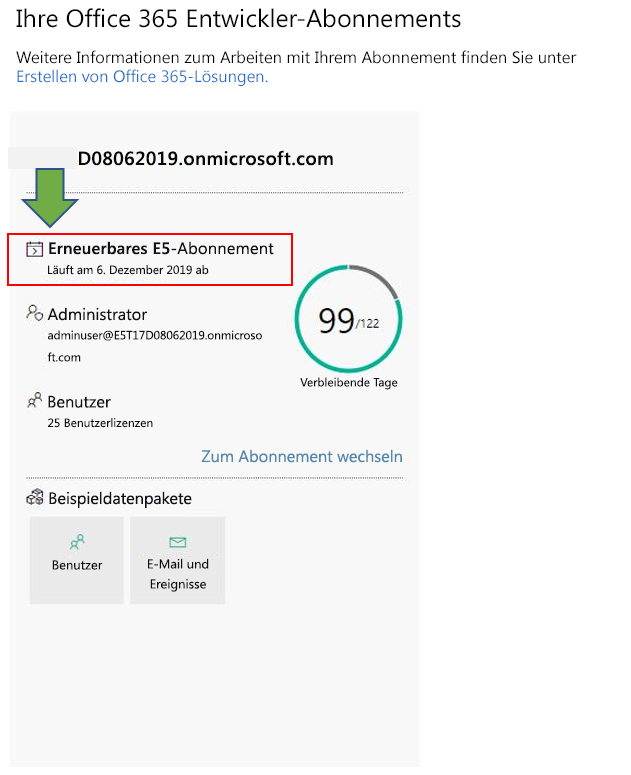

# Häufig gestellte Fragen zum Office 365-Entwicklerprogramm

Nachfolgend finden Sie häufig gestellte Fragen zum Office 365-Entwicklerprogramm.

## Was ist das Office 365-Entwicklerprogramm und wer sollte ihm beitreten?

Das Office 365-Entwicklerprogramm wurde entwickelt, um Ihnen zu helfen, menschenorientierte, plattformübergreifende Produktivitätsumgebungen zu schaffen, die Office 365 erweitern. Treten Sie unserem Programm bei, um Zugang zu den benötigten Tools, Dokumentation, Schulungen, Experten und Communityereignissen zu erhalten, um großartige Lösungen für Office 365-Produkte und -Technologien zu entwickeln, einschließlich:

- [Excel](https://developer.microsoft.com/excel)-, [Outlook](https://developer.microsoft.com/outlook)-, [Word](https://developer.microsoft.com/word)- und [PowerPoint](https://developer.microsoft.com/powerpoint)-Web-Add-Ins
- [SharePoint](https://developer.microsoft.com/sharepoint)
- [Microsoft Teams](https://developer.microsoft.com/microsoft-teams)
- [Microsoft Graph](https://developer.microsoft.com/graph)

Als Teilnehmer des Programms erhalten Sie ein kostenloses Office 365-Entwicklerabonnement mit 25 Benutzerlizenzen erhalten, die Sie zum Erstellen Ihrer Lösungen verwenden können. Dieses Abonnement bleibt so lange aktiv, wie Sie aktiv Lösungen entwickeln und bereitstellen.

Weitere Informationen finden Sie unter [Treten Sie dem Office 365-Entwicklerprogramm bei](office-365-developer-program.md) und [Erstellen von Office 365-Lösungen](build-office-365-solutions.md).

## Welches Konto kann ich verwenden, um mich für das Office 365-Entwicklerprogramm anzumelden?

Sie können sich mit einem der folgenden Kontotypen für das Developer-Programm registrieren:

- **Microsoft-Konto** (von Ihnen für private Zwecke erstellt) – Ermöglicht Zugriff auf alle Microsoft-Produkte und Clouddienste, z. B. Outlook (Hotmail), Messenger, OneDrive, MSN, Xbox Live oder Office 365. Durch Registrieren für ein Outlook.com-Postfach wird automatisch ein Microsoft-Konto erstellt. Nachdem ein Microsoft-Konto erstellt wurde, kann es verwendet werden, um auf Microsoft Cloud-Dienste oder Azure für Verbraucher zuzugreifen. 
- **Geschäftskonto** (wird von einem Administrator für geschäftliche Zwecke ausgegeben) – Ermöglicht Zugriff auf Microsoft Cloud Services für kleine, mittelständische und große Unternehmen, z. B. Azure, Microsoft Intune oder Office 365. Wenn Sie für einen dieser Dienste als Organisation registrieren, wird automatisch ein cloudbasiertes Verzeichnis in Azure Active Directory zur Darstellung bereitgestellt, das für Ihre Organisation steht. Weitere Informationen finden Sie unter [Verwalten Ihres Azure AD-Verzeichnisses](https://docs.microsoft.com/azure/active-directory/active-directory-administer).
- **Visual Studio-ID** (erstellt für Ihr Visual Studio Professional- oder Visual Studio Enterprise-Abonnement) – Wir empfehlen, diese Option zu verwenden, um dem Entwicklerprogramm über Visual Studio Gallery beizutreten und von den kompletten Vorteilen als Visual Studio-Abonnent zu profitieren. 

## Wie erhalte ich ein Office 365-Entwicklerabonnement über das Entwicklerprogramm?  

Wenn Sie am Office 365-Entwicklerprogramm teilnehmen, können Sie ein Office 365-Entwicklerabonnement erhalten. Dabei handelt es sich um ein spezielles Abonnement, das nur für Anwendungsentwicklung entwickelt wurde. Weitere Informationen finden Sie unter [Richten Sie ein Office 365-Entwicklerabonnement ein](office-365-developer-program-get-started.md).

## Welche ID verwende ich, um mich beim Dashboard des Entwicklerprogramms anzumelden.

Melden Sie sich mit Ihrer Mitglieds-ID beim Dashboard des Entwicklerprogramms an, um auf Informationen zu Ihrem Abonnement zuzugreifen. Hierbei handelt es sich um das Microsoft-Konto oder die Azure Active Directory-E-Mail, mit dem/der Sie sich beim Beitritt zum Programm angemeldet haben.

## Welche ID verwende ich für die Anmeldung bei meinem Entwicklerabonnement?

Verwenden Sie die Administrator-ID, die Sie beim Einrichten Ihres Entwicklerabonnements erstellt haben. Ihre Administrator-ID finden Sie auf der Kachel "Abonnement" im [Dashboard des Entwicklerprogramms](https://developer.microsoft.com/de-DE/office/profile).

## Was ist im Entwicklerabonnement enthalten?

Wenn Sie Ihr Abonnement nach dem 25. August 2019 abgeschlossen haben, verfügen Sie über ein Microsoft 365 E5-Entwicklerabonnement mit 25 Benutzerlizenzen. Kunden, die dem Programm vor dem 25. August 2019 beigetreten sind, haben ein Office 365 E3-Entwicklerabonnement mit 25 Benutzerlizenzen.

Das Office 365 E3-Entwicklerabonnement umfasst Folgendes:

- [Exchange Online (Plan 2)](https://products.office.com/exchange/compare-microsoft-exchange-online-plans)
- [Microsoft Flow für Office 365](https://flow.microsoft.com/pricing/)
- [Information Protection für Office 365 – Standard](https://products.office.com/de-DE/business/azure-information-protection-for-office-365)
- [Microsoft Forms (Plan E5)](https://support.office.com/article/Frequently-asked-questions-about-Microsoft-Forms-495c4242-6102-40a0-add8-df05ed6af61c)
- [Microsoft Planner](https://products.office.com/compare-all-microsoft-office-products?tab=2)
- [Microsoft Search](https://products.office.com/en-us/business/intelligent-search?tab=Discovery)
- [Microsoft Stream für Office 365 E5 SKU](https://products.office.com/business/office-365-enterprise-e5-business-software)
- [Microsoft Teams](https://products.office.com/business/office-365-enterprise-e5-business-software)
- [Verwaltung mobiler Geräte in Office 365](https://support.office.com/article/Set-up-Mobile-Device-Management-MDM-in-Office-365-dd892318-bc44-4eb1-af00-9db5430be3cd)
- [Office 365 ProPlus](https://products.office.com/business/office-365-proplus-business-software)
- [Office für das Web](https://docs.microsoft.com/de-DE/office365/servicedescriptions/office-online-service-description/office-online-service-description)
- [PowerApps für Office 365](https://powerapps.microsoft.com/pricing/)
- [SharePoint Online für Entwickler](https://products.office.com/SharePoint/compare-sharepoint-plans)
- [Skype for Business Online Plan 2](https://products.office.com/skype-for-business/online-meeting-solutions)
- [Sway](https://sway.com/)
- [To-do (Plan 3)](https://todo.microsoft.com)
- [Whiteboard (Plan 2)](https://products.office.com/de-DE/microsoft-whiteboard/digital-whiteboard-app)

Das Microsoft 365 E5-Entwicklerabonnement enthält alle Apps, die im Office 365 E3-Entwicklerabonnement enthalten sind, sowie die folgenden neuen Funktionen:  

- Fortschrittliche Analysefunktionen mit Power BI  
- Enterprise Mobility + Security (EMS) für Compliance und Informationsschutz  
- Office 365 Advanced Threat Protection 
- Azure Active Directory für den Aufbau erweiterter Identitäts-und Zugriffsverwaltungslösungen  

Das Microsoft 365 E5-Entwicklerabonnement umfasst Folgendes: 

- Azure Active Directory Premium P1 
- Azure Active Directory Premium P2 
-   Azure Advanced Threat Protection 
-   Azure Information Protection Premium P1 
-   Azure Information Protection Premium P2 
-   Kunden-Lockbox 
-   Exchange Online (Plan 2) 
-   Microsoft Flow für Office 365 
-   Information Protection für Office 365 – Premium 
-   Information Protection für Office 365 – Standard 
-   Microsoft Azure Active Directory-Rechte 
-   Microsoft Azure Multi-Factor Authentication 
-   Microsoft Cloud App Security 
-   Microsoft Forms (Plan E5) 
-   Microsoft Intune 
-   Microsoft MyAnalytics (Vollversion) 
-   Microsoft Planner 
-   Microsoft StaffHub 
-   Microsoft Stream für Office 365 E5 SKU 
-   Microsoft Teams 
-   Verwaltung mobiler Geräte für Office 365 
-   Office 365 Advanced eDiscovery 
-   Office 365 Advanced Security Management 
-   Office 365 Advanced Threat Protection (Plan 1) 
-   Office 365 Advanced Threat Protection (Plan 2) 
-   Office 365 Privileged Access Management 
-   Office 365 ProPlus 
-   Office Online 
-   Telefonsystem 
-   Power BI Pro 
-   PowerApps für Office 365 Plan 3 
-   SharePoint Online (Plan 2) 
-   Skype for Business Online (Plan 2) 
-   Sway 
-   To-Do (Plan 3) 
-   Whiteboard (Plan 3) 
-   Yammer Enterprise 

Ob Sie über ein Microsoft 365 E5-Abonnement oder ein Office 365 E3-Abonnement verfügen, können Sie auf der Abonnementkachel auf Ihrem [Dashboard](https://developer.microsoft.com/office/profile) feststellen. Auf der Kachel wird unterhalb des Domänennamens des Abonnements entweder E3 oder E5 angezeigt.

.

## Umfasst das Abonnement auch ein Abonnement für Azure?

Dieses Angebot schließt kein Abonnement für Azure ein. Um aber kostenlosen Zugriff auf Azure-Dienste zu erhalten, können Sie [ein kostenloses Azure-Konto erstellen](https://azure.microsoft.com/free/). 

## Wie viele Benutzerlizenzen enthält das Office 365-Entwicklerabonnement?

Ihr Office 365-Entwicklerabonnement enthält 25 Benutzerlizenzen, einschließlich des Administrators, (nur für Entwicklungszwecke). Die Verwendung dieses Abonnements für andere Zwecke als die Anwendungsentwicklung ist ein Verstoß gegen die Lizenzvereinbarung. Weitere Informationen über die Lizenzeinschränkungen finden Sie unter der [Office 365-Entwicklerabonnement – Nutzungsbedingungen](terms-and-conditions.md).

## Wie lange ist mein Abonnement gültig und wann läuft es ab?

Ihr Abonnement ist 90 Tage gültig und verlängerbar, basierend auf gültiger Entwickleraktivität. Wenn Sie Ihr Abonnement für die Entwicklung verwenden, wird es alle 3 Monate verlängert und ist unbegrenzt verfügbar. Das Ablaufdatum, zusammen mit dem Abonnementnamen, finden Sie im [Dashboard des Office 365-Entwicklerprogramms](https://developer.microsoft.com/de-DE/office/profile). Weitere Informationen finden Sie unter [Ablauf und Verlängerung für das Abonnement](subscription-expiration-and-renewal.md).

Wenn Sie dem Programm über Visual Studio Enterprise oder Visual Studio Professional beitreten, wird Ihr Abonnement automatisch verlängert, bis Ihr Visual Studio-Abonnement abläuft. 

## Warum bieten Sie kein 1-Jahres-Abonnement an?

Im April 2019 haben wir zu einem neuen Modell gewechselt, bei dem Ihr Abonnement alle 90 Tage erneuert werden kann, wenn Sie es aktiv für die Entwicklung nutzen. Wir sind der Meinung, dass dieses Modell sicherstellt, dass Entwicklern, die aktiv Lösungen entwickeln, ein Abonnement zur Verfügung steht, solange sie es benötigen. Wenn Sie häufig entwickeln, läuft Ihr Abonnement nie ab; es wird automatisch verlängert. Wenn Sie für kurze Zeit entwickeln und Ihr Abonnement abläuft und gelöscht wird, können Sie sich für ein neues Abonnement anmelden. 

Wenn Sie ein Abonnement bevorzugen, das für eine längere Zeit verfügbar ist, empfehlen wir Ihnen, das Abonnement für Visual Studio Professional oder Visual Studio Enterprise zu erwerben. Diese Programme enthalten ein kostenloses Office 365-Entwicklerabonnement, das für die Dauer Ihres Visual Studio-Abonnements gültig ist. Um darauf zuzugreifen, navigieren Sie zu [Visual Studio | Meine Vorteile ](https://my.visualstudio.com/benefits). Weitere Informationen erhalten Sie unter [Visual Studio-Kundendienst](https://www.visualstudio.com/subscriptions/support/). 

## Wie stellen Sie fest, ob ein Abonnement verlängert werden kann?

Wir verwenden eine Reihe von Algorithmen und Telemetrie, die wir aus Ihrer Tätigkeit im Office 365-Entwicklerprogramm und in Ihrem Office 365-Entwicklerabonnement erhalten, um zu ermitteln, ob Sie aktiv entwickeln. Wir überprüfen diese regelmäßig, um Ihren Status zu aktualisieren und festzustellen, ob Ihr Abonnement verlängert werden sollte. 

Wenn Sie der Meinung sind, dass wir Ihre Entwicklungsaktivitäten aus irgendeinem Grund nicht genau verfolgt haben, können Sie uns dies über Ihr Dashboard mitteilen. Um ein Formular einzureichen, das uns mitteilt, wie Sie Ihr Abonnement für die Entwicklung verwenden, wählen Sie in der Dashboard-Warnung den Link **Informieren Sie uns**, wie im folgenden Bild gezeigt. Wir überprüfen Ihre Anforderung und lassen Sie wissen, ob Sie sich für eine Verlängerung qualifizieren. 

 

## Wie definieren Sie Entwicklungsaktivität?

Ihre Aktivitäten im Office 365-Entwicklerprogramm und in Ihrem Office 365-Entwicklerabonnement bestimmen, ob Sie aktiv entwickeln und ob Ihr Abonnement verlängert werden sollte. 

Weitere Informationen dazu, welche Arten von Aktivitäten wir verfolgen, finden Sie unter [Office 365-Entwicklerabonnement – Nutzungsbedingungen](terms-and-conditions.md). 

## Kann ich mein Abonnement verlängern, wenn es bald abläuft?

Die einzige Möglichkeit, Ihr Abonnement zu verlängern, besteht darin, gültige Entwickleraktivitäten durchzuführen. Wenn Sie Ihr Abonnement zur Entwicklung benutzerdefinierter Lösungen verwenden, läuft Ihr Abonnement ab und wird schließlich gelöscht. 

Weitere Informationen finden Sie unter [Ablauf und Verlängerung für das Abonnement](subscription-expiration-and-renewal.md).

## Wenn mein Abonnement abläuft, wie viel Zeit habe ich, bevor es gelöscht wird?

Nachdem Ihr Abonnement abgelaufen ist, haben Sie 30 Tage Zeit, Ihre Daten zu migrieren. Für die nächsten 30 Tage hat nur der Administrator Zugriff auf das Abonnement, und am 60. Tag werden das Abonnement und alle Daten gelöscht.

## Wie kann ich von einem Office 365 E3-Abonnement zu einem Microsoft 365 E5-Abonnement migrieren?

Aktuell erhalten nur neue Mitglieder des Office 365-Entwicklerprogamms automatisch ein Microsoft 365 E5-Entwicklerabonnement. Bestehenden Benutzern wird künftig eine Möglichkeit für die Migration zu einem Microsoft 365 E5-Entwicklerabonnement angeboten. Seien Sie versichert: Wir arbeiten daran, allen Mitglieder des Office 365-Entwicklerprogramms zu ermöglichen, zu Microsoft 365 E5 zu migrieren. 

## Kann ich mich zwischen einem Office 365 E3- oder einem Microsoft 365 E5-Abonnement entscheiden?

Derzeit wird nur neuen Mitgliedern des Entwicklerprogramms ein Microsoft 365 E5-Abonnement angeboten. Bei bestehenden Mitgliedern mit einem Office 365 E3-Abonnement besteht die Möglichkeit, das aktuelle Abonnement beizubehalten und es weiter zu verlängern, wenn die neuen Funktionen in Microsoft 365 E5 nicht benötigt werden. Mitglieder des Entwicklerprogramms können nur ein Abonnement haben.  

Sobald eine Migrationsoption für bestehende Mitglieder des Entwicklerprogramms besteht, werden wir weitere Informationen zum Migrieren bereitstellen. 

## Kann ich als Microsoft-Partner ein Abonnement erhalten? 

Ja, Sie können die [folgenden Anweisungen](office-365-developer-program.md) befolgen, um am Office 365-Entwicklerprogramm teilzunehmen und ein Office 365-Entwicklerabonnement einzurichten. Wenn Sie aber bereits ein Visual Studio Enterprise- oder Visual Studio Professional-Abonnement (MSDN) haben, können Sie zusätzlich ein Office 365-Entwicklerabonnement erhalten. Um darauf zuzugreifen, navigieren Sie zu [Visual Studio | Meine Vorteile ](https://my.visualstudio.com/benefits). Weitere Informationen erhalten Sie unter [Visual Studio-Kundendienst](https://www.visualstudio.com/subscriptions/support/). 

## Kann ich als Vollzeitmitarbeiter von Microsoft ein Abonnement erhalten?

Microsoft-Mitarbeiter können sich nicht für dieses Angebot registrieren. Alle Vollzeitmitarbeiter von Microsoft haben Zugriff auf ein kostenloses Visual Studio (MSDN)-Abonnement, das Zugriff auf ein Microsoft 365 E5-Entwicklerabonnement umfasst. Sie können unter [Visual Studio | Meine Angebote](https://my.visualstudio.com/benefits) auf dieses Angebot zugreifen.

## Komme ich als Anbieter bei Microsoft für ein Abonnement in Frage?

Ja, Sie können die [folgenden Anweisungen](office-365-developer-program.md) befolgen, um am Office 365-Entwicklerprogramm teilzunehmen und ein Office 365-Entwicklerabonnement einzurichten. Aber auch für Anbieter ist dieses Abonnement so konzipiert, dass es _nur für die Anwendungsentwicklung_ verwendet werden kann. Wenn Sie keine gültigen Entwicklungsaktivitäten durchführen, wird Ihr Abonnement nicht verlängert.

## Ist das Office 365-Entwicklerprogramm in meiner Sprache verfügbar?

Neben Englisch ist das Office 365-Entwicklerprogramm in den folgenden Sprachen verfügbar: Chinesisch (vereinfacht), Deutsch, Französisch, Japanisch, Portugiesisch (Brasilien), Russisch und Spanisch.

## Ist das Office 365-Entwicklerabonnement in meiner Sprache verfügbar?

Das Office 365-Entwicklerabonnement wird nur auf Englisch angeboten.

## Support

Wenn Sie Probleme beim Einrichten Ihres Abonnements haben, sehen Sie sich die folgenden Supportressourcen an:

- [Stack Overflow](https://stackoverflow.com/questions)   
- [Visual Studio-Kundendienst](https://www.visualstudio.com/subscriptions/support/)

## Siehe auch

- [Treten Sie dem Office 365-Entwicklerprogramm bei](office-365-developer-program.md)
- [Richten Sie ein Office 365-Entwicklerabonnement ein](office-365-developer-program-get-started.md)
- [Verwenden Ihres Entwicklerabonnements zum Erstellen von Office 365-Lösungen](build-office-365-solutions.md)
- [Verlängern eines ablaufenden Abonnements](subscription-expiration-and-renewal.md)

 

 

 

 

 

 
