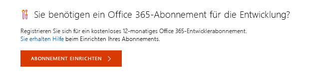
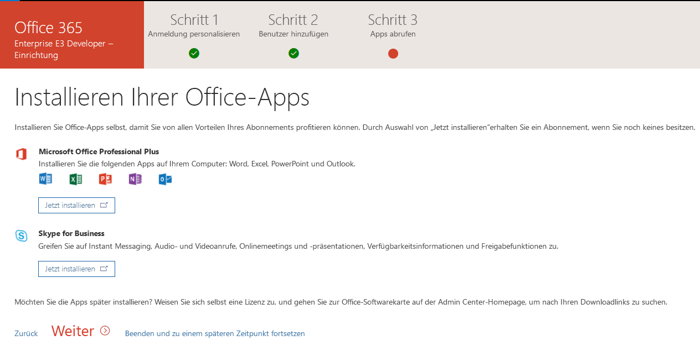

# Richten Sie ein Office 365-Entwicklerabonnement ein 

Richten Sie ein Office 365-Entwicklerabonnement ein, um unabhängig von Ihrer Produktionsumgebung Lösungen zu entwickeln und zu testen. Das Abonnement ist ein Office 365 Enterprise E3 Developer-Abonnement mit 25 Benutzerlizenzen. Es gilt für ein Jahr und kann für Entwicklungszwecke (Codierung und Testen von Lösungen) kostenlos verwendet werden.

> [!NOTE] 
> Wenn Sie ein Abonnement einrichten möchten, müssen Sie zuerst [dem Office 365-Entwicklerprogramm beitreten](office-365-developer-program.md). Danach haben Sie die Möglichkeit, ein Abonnement einzurichten.

## Einrichten Ihres Abonnements

1. Um ein Office 365-Entwicklerabonnement zu erhalten, wählen Sie auf Ihrer Profilseite unter **Sie benötigen ein Office 365-Abonnement für die Entwicklung?** die Option **Abonnement einrichten** aus.

  

2. Erstellen Sie im Dialogfeld **Einrichten Ihres Entwicklerabonnements** einen Benutzernamen und eine Domäne. Dieses Konto muss globale Administratorberechtigungen für das Abonnement besitzen. Sie können einen beliebigen Benutzer- und Domänennamen verwenden, sofern dieser nichts bereits verwendet wird. Verwenden Sie keine Leerzeichen.

  

3. Erstellen und bestätigen Sie ein Kennwort.

4. Wählen Sie **Einrichten** aus.

5. Wenn Sie aufgefordert werden, zu bestätigen, dass Sie kein Roboter sind, folgen Sie den Anweisungen, und wählen Sie dann **Überprüfen**.

6. Nachdem das Abonnement erstellt wurde, werden der Abonnementname und das Ablaufdatum auf Ihrer Profilseite angezeigt.

  > [!IMPORTANT]
  > Notieren Sie Ihren Benutzernamen und das Kennwort, da Sie dies für den Zugriff auf Ihr Entwicklerabonnement benötigen.

## Konfigurieren des Abonnements

1. Wählen Sie auf Ihrer Profilseite den Link [office.com](https://www.office.com/) aus, und melden Sie sich mit Ihrer Benutzer-ID (z. B. username@domain.onmicrosoft.com) und mit dem Kennwort an, das Sie für Ihr Entwicklerabonnement angegeben haben.

   > [!NOTE] 
   > Melden Sie sich bei Ihrem Abonnement nicht mit Ihren Anmeldeinformationen für das Entwicklerprogramm an.

2. Verwenden Sie das App-Startfeld, um zum [Admin Center](https://portal.office.com/adminportal/home#/homepage) zu wechseln.

3. Wählen Sie auf der Admin Center-Startseite die Option **Zu Setup wechseln** aus. Auf diese Weise gelangen Sie zur Seite **Office 365 Enterprise E3 Developer Setup**.

4. **Personalisieren Sie Ihre Anmeldung und Ihre E-Mail**. Sie können Ihr Abonnement mit einer Domäne verbinden oder einfach die vorhandene Unterdomäne erstellen, die Sie erstellt haben. Wenn Sie bereit sind, wählen Sie **Weiter**.

  

5. **Fügen Sie neue Benutzer hinzu**. Sie können Benutzer hinzufügen. Dies können fiktive Benutzer sein, die Sie für Testzwecke benötigen, oder reale Benutzer, die Ihnen bei der Entwicklung helfen. Wenn Sie bereit sind, wählen Sie **Weiter**.
    
  > [!NOTE]
  > Wenn Sie Benutzer per Massenvorgang hinzufügen müssen, können Sie dies später tun. Weitere Informationen finden Sie unter [Hinzufügen von einzelnen Benutzern oder Massenhinzufügen von Benutzern zu Office 365 – Administratorhilfe](https://support.office.com/de-DE/article/add-users-individually-or-in-bulk-to-office-365-admin-help-1970f7d6-03b5-442f-b385-5880b9c256ec).

6. **Zuweisen von Lizenzen zu nicht lizenzierten Benutzer**. Erteilen Sie allen Benutzern, mit denen Sie mit dem Abonnement zusammenarbeiten möchten, eine Lizenz. Wenn Sie bereit sind, wählen Sie **Weiter**.

7. **Freigeben von Anmeldeinformationen**. Sie müssen ihre Anmeldeinformationen für alle realen Benutzer freigeben, die auf das Abonnement zugreifen. Sie können eine Methode auswählen, z. B. E-Mail, Download oder Drucken. Wenn Sie bereit sind, wählen Sie **Weiter**.

8. **Installieren Ihrer Office-Apps**. Sie haben die Möglichkeit, Office-Apps auf Ihrem Computer zu installieren. Wenn Sie bereit sind, wählen Sie **Weiter**.

  

   > [!NOTE] 
   > Bei nachfolgenden Besuchen des Dashboards melden Sie sich mit dem Konto *username@domain*.onmicrosoft.com an, bevor Sie zum Dashboard wechseln.

9. **Sie haben das Ende des Setups erreicht**. Sie haben die Einrichtung Ihres Abonnements abgeschlossen. Optional können Sie Ihre Erfahrung bewerten. Wenn Sie fertig sind, wählen Sie **Zum Admin Center wechseln**.
    
   > [!NOTE] 
   > Derzeit ist die Region des Abonnements standardmäßig auf Nordamerika eingestellt, unabhängig davon, in welchem Land bzw. in welcher Region Sie sich befinden. Sie können Ihr Entwicklerabonnement weiter einrichten und verwenden.

## Bereitstellen von Office 365-Diensten

Es dauert einige Zeit, bis die die Back-End-Dienste wie SharePoint und Exchange für das Abonnement bereitgestellt wurden. Bei diesem Schritt wird für einige Symbole im App-Startfeld und auf der Startseite angezeigt, **dass diese noch eingerichtet werden (bzw. dass die App noch eingerichtet wird)**. Dies dauert nicht länger als eine Stunde.

Wenn die Bereitstellung abgeschlossen ist, können Sie das neue Office 365-Abonnement zum Entwickeln und Testen verwenden. Das Abonnement läuft nach einem Jahr ab.

Wir empfehlen außerdem, dass Sie Release-Optionen aktivieren, um sicherzustellen, dass Sie so bald wie möglich Zugriff auf die neuesten Office 365-Features erhalten. Weitere Informationen finden Sie unter [Einrichten der Standard- oder Targeted Release-Optionen in Office 365](https://support.office.com/en-us/article/set-up-the-standard-or-targeted-release-options-in-office-365-3b3adfa4-1777-4ff0-b606-fb8732101f47?ui=en-US&rs=en-US&ad=US).

## Einrichten eines Microsoft Azure-Kontos

Für einige Office-Lösungen benötigen Sie möglicherweise ein Microsoft Azure-Konto zum Erstellen und Testen mithilfe von Azure-Diensten. Informationen zum Einrichten eines kostenlosen Azure-Kontos finden Sie unter [Erstellen Sie noch heute Ihr kostenloses Azure-Konto](https://azure.microsoft.com/de-DE/free/).

## Das Entwicklerprogramm verlassen

Wenn Sie beschließen, dass Sie nicht mehr am Office 365-Entwicklerprogramm teilnehmen möchten, können Sie Ihr Abonnement beenden und das Programm verlassen.

  > [!WARNING]
  > Mit den folgenden Schritten werden Ihre gesamten Profilinformationen gelöscht. Es werden alle in Ihrem Entwicklerprogramm gespeicherten Daten gelöscht, die nicht an anderer Stelle gesichert sind.

1. Melden Sie sich beim Entwicklerprogramm an.

2. Wählen Sie **Profil löschen** aus.

3. Wählen Sie im Bestätigungsfeld **Profil löschen** die Option **Löschen** aus.

## Siehe auch

- [Treten Sie dem Office 365-Entwicklerprogramm bei](office-365-developer-program.md)
- [Verwenden Ihres Entwicklerabonnements zum Erstellen von Office 365-Lösungen](build-office-365-solutions.md)
- [Häufig gestellte Fragen zum Office 365-Entwicklerprogramm](office-365-developer-program-faq.md)
