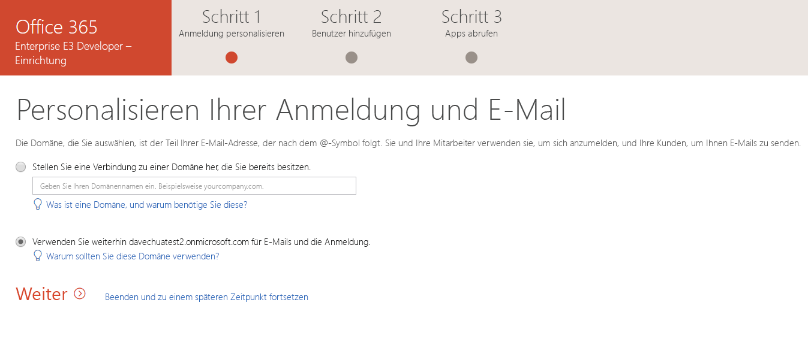

# Richten Sie ein Office 365-Entwicklerabonnement einSet up an Office 365 developer subscription 

Richten Sie ein Office 365-Entwicklerabonnement ein, um unabhängig von Ihrer Produktionsumgebung Lösungen zu entwickeln.Set up an Office 365 developer subscription to build and test your solutions independent of your production environment. Das Abonnement ist ein Office 365 Enterprise E3 Developer-Abonnement mit 25 Benutzerlizenzen.The subscription is an Office 365 Enterprise E3 Developer subscription with 25 user licenses. Es gilt für 90 Tage und kann für Entwicklungszwecke (Codierung von Lösungen) kostenlos verwendet werden.It lasts for one year and is free to use for development purposes (coding and testing solutions).

> [!NOTE] 
> Wenn Sie ein Abonnement einrichten möchten, müssen Sie zuerst [dem Office 365-Entwicklerprogramm beitreten](office-365-developer-program.md).To set up a subscription, you must first [join the Office 365 Developer Program](office-365-developer-program.md). Danach haben Sie die Möglichkeit, ein Abonnement einzurichten.After joining, you'll see the option to set up a subscription.

## Einrichten Ihres AbonnementsSet up your subscription

1. Um ein Office 365-Entwicklerabonnement zu erhalten, wählen Sie auf Ihrer Profilseite unter **Sie benötigen ein Office 365-Abonnement für die Entwicklung?** die Option **Abonnement einrichten** aus.To get an Office 365 developer subscription, on your profile page, under **Need an Office 365 subscription to use for development?**, choose **Set up subscription**.

  

2. Erstellen Sie im Dialogfeld **Einrichten Ihres Entwicklerabonnements** einen Benutzernamen und eine Domäne.In the **Set up your developer subscription** dialog box, create a username and domain. Dieses Konto muss globale Administratorberechtigungen für das Abonnement besitzen.This account will have global administrator permissions for the subscription. Sie können einen beliebigen Benutzer- und Domänennamen verwenden, sofern dieser nichts bereits verwendet wird.You can choose any username or domain name as long as it is not already in use. Verwenden Sie keine Leerzeichen.Do not use spaces.

  

3. Erstellen und bestätigen Sie ein Kennwort.Create and confirm a password.

4. Wählen Sie **Einrichten** aus.Choose **Set up**.

5. Wenn Sie aufgefordert werden, zu bestätigen, dass Sie kein Roboter sind, folgen Sie den Anweisungen, und wählen Sie dann **Überprüfen**.If you are asked to prove you're not a robot, follow the instructions, and then choose **Verify**.

6. Nachdem das Abonnement erstellt wurde, werden der Abonnementname und das Ablaufdatum auf Ihrer Profilseite angezeigt.After the subscription is created, your subscription name and expiration date appear on your profile page.

  > [!IMPORTANT]
  > Notieren Sie Ihren Benutzernamen und das Kennwort, da Sie dies für den Zugriff auf Ihr Entwicklerabonnement benötigen.Make a note of your username and password because you'll need it to access your developer subscription.

## Konfigurieren des AbonnementsConfigure the subscription

1. Wählen Sie auf Ihrer Profilseite den Link [office.com](https://www.office.com/) aus, und melden Sie sich mit Ihrer Benutzer-ID (z. B. username@domain.onmicrosoft.com) und mit dem Kennwort an, das Sie für Ihr Entwicklerabonnement angegeben haben.On your profile page, choose the office.com link and sign in with your user ID (for example, username@domain.onmicrosoft.com) and the password you specified for your developer subscription.

   > [!NOTE] 
   > Melden Sie sich bei Ihrem Abonnement nicht mit Ihren Anmeldeinformationen für das Entwicklerprogramm an.Do not sign in to your subscription with your developer program credentials.

2. Verwenden Sie das App-Startfeld, um zum [Admin Center](https://portal.office.com/adminportal/home#/homepage) zu wechseln.Use the app launcher to go to the [Admin center](https://portal.office.com/adminportal/home#/homepage).

3. Wählen Sie auf der Admin Center-Startseite die Option **Zu Setup wechseln** aus.On the Admin center home page, choose **Go to setup**. Auf diese Weise gelangen Sie zur Seite **Office 365 Enterprise E3 Developer Setup**.This will take you to the **Office 365 Enterprise E3 Developer Setup** page.

4. **Personalisieren Sie Ihre Anmeldung und Ihre E-Mail**.**Personalize your sign-in and email**. Sie können Ihr Abonnement mit einer Domäne verbinden oder einfach die vorhandene Unterdomäne erstellen, die Sie erstellt haben.You can connect your subscription to a domain, or just use the existing subdomain that you created. Wenn Sie bereit sind, wählen Sie **Weiter**.When ready, choose **Next**.

  

5. **Fügen Sie neue Benutzer hinzu**.**Add new users**. Sie können Benutzer hinzufügen.You can add users. Dies können fiktive oder reale Benutzer sein, die Ihnen bei der Entwicklung helfen.These could be fictional users that you need for testing, or real users helping you with development. Wenn Sie bereit sind, wählen Sie **Weiter**.When ready, choose **Next**.
    
  > [!NOTE]
  > Wenn Sie Benutzer per Massenvorgang hinzufügen müssen, können Sie dies später tun.If you need to bulk-add users, you can do this later. Weitere Informationen finden Sie unter [Hinzufügen von einzelnen Benutzern oder Massenhinzufügen von Benutzern zu Office 365 – Administratorhilfe](https://support.office.com/article/add-users-individually-or-in-bulk-to-office-365-admin-help-1970f7d6-03b5-442f-b385-5880b9c256ec).For more information, see [Add users individually or in bulk to Office 365 - Admin Help](https://support.office.com/article/add-users-individually-or-in-bulk-to-office-365-admin-help-1970f7d6-03b5-442f-b385-5880b9c256ec).

6. **Zuweisen von Lizenzen zu nicht lizenzierten Benutzer**.**Assign licenses to unlicensed users**. Erteilen Sie allen Benutzern, mit denen Sie mit dem Abonnement zusammenarbeiten möchten, eine Lizenz.For any users that you want to be able to work with the subscription, grant them a license. Wenn Sie bereit sind, wählen Sie **Weiter**.When ready, choose **Next**.

7. **Freigeben von Anmeldeinformationen**.**Share sign-in credentials**. Sie müssen ihre Anmeldeinformationen für alle realen Benutzer freigeben, die auf das Abonnement zugreifen.For any real users who will access the subscription, you must share their sign-in credentials with them. Sie können eine Methode auswählen, z. B. E-Mail, Download oder Drucken.You can choose a method, such as email, download, or print. Wenn Sie bereit sind, wählen Sie **Weiter**.When ready, choose **Next**.

8. **Installieren Ihrer Office-Apps**.**Install your Office apps**. Sie haben die Möglichkeit, Office-Apps auf Ihrem Computer zu installieren.You have the option of installing Office apps to your computer. Wenn Sie bereit sind, wählen Sie **Weiter**.When ready, choose **Next**.

  

   > [!TIP] 
   > Bei nachfolgenden Besuchen des Dashboards melden Sie sich mit dem Konto *username@domain*.onmicrosoft.com an, bevor Sie zum Dashboard wechseln.On subsequent visits to the Dashboard, sign in with your username@domain.onmicrosoft.com account before you go to the Dashboard.

9. **Sie haben das Ende des Setups erreicht**.**You've reached the end of setup**. Sie haben die Einrichtung Ihres Abonnements abgeschlossen.You've completed the setup for your subscription. Optional können Sie Ihre Erfahrung bewerten.You can optionally rate the experience. Wenn Sie fertig sind, wählen Sie **Zum Admin Center wechseln**.When ready, choose **Go to the Admin center**.
    
   > [!NOTE] 
   > Derzeit ist die Region des Abonnements standardmäßig auf Nordamerika eingestellt, unabhängig davon, in welchem Land bzw. in welcher Region Sie sich befinden.At this time, the subscription's region defaults to North America regardless of which country/region you are in. Sie können Ihr Entwicklerabonnement weiter einrichten und verwenden.You can still proceed with setting up and using your developer subscription.

## Bereitstellen von Office 365-DienstenProvision Office 365 services

Es dauert einige Zeit, bis die die Back-End-Dienste wie SharePoint und Exchange für das Abonnement bereitgestellt wurden.It will take some time for the backend services, such as SharePoint and Exchange, to provision for the subscription. Bei diesem Schritt wird für einige Symbole im App-Startfeld und auf der Startseite angezeigt, **dass diese noch eingerichtet werden (bzw. dass die App noch eingerichtet wird)**.During this step, some of the icons in the app launcher and on the Home page show as **Setting up (This app is still being set up)**. Dies dauert nicht länger als eine Stunde.This will take no longer than an hour.

Wenn die Bereitstellung abgeschlossen ist, können Sie das neue Office 365-Abonnement zum Entwickeln verwenden.When the provisioning is complete, you can use the new Office 365 subscription for development and testing. Das Abonnement läuft nach 90 Tagen ab.The subscription expires after 90 days. Zum Verlängern lesen Sie [Kann ich mein Abonnement verlängern, wenn es bald abläuft?](office-365-developer-program-faq.md#renew-subscription)When my subscription is about to expire, can I extend it?

Wir empfehlen außerdem, dass Sie Release-Optionen aktivieren, um sicherzustellen, dass Sie so bald wie möglich Zugriff auf die neuesten Office 365-Features erhalten.We also recommend that you enable release options to ensure that you get access to the latest Office 365 features as soon as possible. Weitere Informationen finden Sie unter [Einrichten der Standard- oder Targeted Release-Optionen in Office 365](https://support.office.com/article/set-up-the-standard-or-targeted-release-options-in-office-365-3b3adfa4-1777-4ff0-b606-fb8732101f47).For more information, see [Set up the Standard or Targeted release options in Office 365](https://support.office.com/article/set-up-the-standard-or-targeted-release-options-in-office-365-3b3adfa4-1777-4ff0-b606-fb8732101f47).

## Einrichten eines Microsoft Azure-KontosSet up a Microsoft Azure account

Für einige Office-Lösungen benötigen Sie möglicherweise ein Microsoft Azure-Konto zum Erstellen mithilfe von Azure-Diensten.For some Office solutions, you might need a Microsoft Azure account to build and test using Azure services. Informationen zum Einrichten eines kostenlosen Azure-Kontos finden Sie unter [Erstellen Sie noch heute Ihr kostenloses Azure-Konto](https://azure.microsoft.com/free/).To set up a free Azure account, see [Create your Azure free account today](https://azure.microsoft.com/free/).

## Verlassen des Office 365-EntwicklerprogrammsJoin the Office 365 Developer Program

Wenn Sie beschließen, dass Sie nicht mehr am Office 365-Entwicklerprogramm teilnehmen möchten, können Sie Ihr Abonnement beenden und das Programm verlassen.If you decide that you no longer want to participate in the Office 365 Developer Program, you can end your subscription and leave the program.

  > [!WARNING]
  > Mit den folgenden Schritten werden Ihre gesamten Profilinformationen gelöscht.The following steps will erase all of your profile information. Es werden alle in Ihrem Entwicklerprogramm gespeicherten Daten gelöscht, die nicht an anderer Stelle gesichert sind.You will lose any data stored in your developer subscription that is not backed up elsewhere.

1. Melden Sie sich beim Office 365-Entwicklerprogramm an.Welcome to the Office 365 Developer Program

2. Wählen Sie **Profil löschen** aus.Choose **Delete Profile**.

3. Wählen Sie im Bestätigungsfeld **Profil löschen** die Option **Löschen** aus.In the **Delete Profile** confirmation box, choose **Delete**.

## Siehe auchSee also

- [Treten Sie dem Office 365-Entwicklerprogramm bei.Join the Office 365 Developer Program](office-365-developer-program.md)
- [Verwenden Ihres Entwicklerabonnements zum Erstellen von Office 365-LösungenUse your subscription to build Office 365 solutions](build-office-365-solutions.md)
- [Verlängern eines ablaufenden AbonnementsRenew an expiring subscription](subscription-expiration-and-renewal.md)
- [Häufig gestellte Fragen zum Office 365-EntwicklerprogrammOffice 365 Developer Program FAQ](office-365-developer-program-faq.md)
