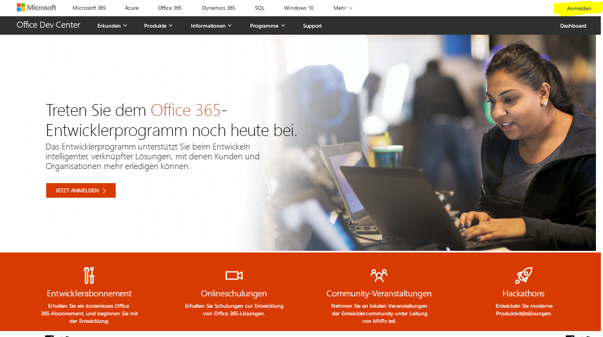
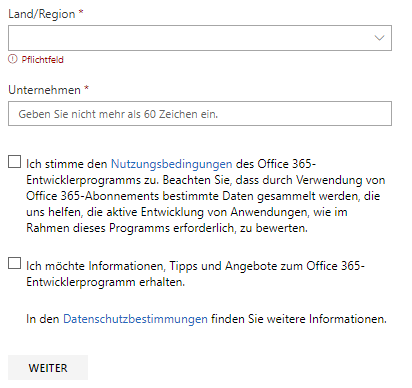
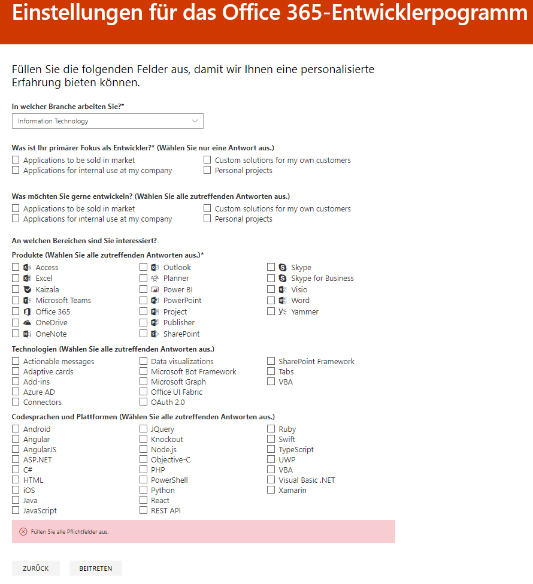
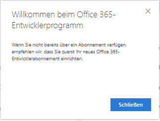

# Willkommen beim Office 365-Entwicklerprogramm

Überzeugen Sie Ihre Freunde und Kollegen vom Office 365-Entwicklerprogramm. Verwenden Sie das Office 365-Entwicklerabonnement, um unabhängig von Ihrer Produktionsumgebung Lösungen zu entwickeln. Sie können Lösungen für Microsoft Teams, Office-Add-Ins, Microsoft Graph, SharePoint Framework, SharePoint-Add-Ins und vieles mehr erstellen.

## Treten Sie dem Office 365-Entwicklerprogramm bei.

1. Rufen Sie die Seite [Treten Sie dem Office 365-Entwicklerprogramm bei](https://developer.microsoft.com/office/dev-program) auf. 

2. Wählen Sie in der oberen rechten Ecke **Anmelden** aus, um sich mit Ihrem Microsoft-Konto oder Ihrem Azure Active Directory-fähigen E-Mail-Konto anzumelden.

    > [!NOTE]
    > Merken Sie sich das Konto, mit dem Sie sich anmelden. Mit diesem Konto melden Sie sich beim [Dashboard des Entwicklerprogramms](https://developer.microsoft.com/office/profile) an. Dieses Konto unterscheidet sich von der Admin-ID, die Sie für Ihr Microsoft 365-Entwicklerabonnement verwenden.

  

3. Wählen Sie nach der Anmeldung **Jetzt beitreten** aus.

4. Füllen Sie auf der Seite **Registrierung beim Office 365-Entwicklerprogramm** die folgenden Felder im Onlineformular aus:

  - **Kontakt-E-Mail**
  - **Land/Region**
  - **Unternehmen**

  

5. Lesen Sie die **Geschäftsbedingungen**. Sie müssen das Kontrollkästchen aktivieren, bevor Sie beitreten können.

6. Aktivieren Sie optional das Kontrollkästchen **Ich möchte Informationen, Tipps und Angebote zum Office 365-Entwicklerprogramm erhalten**, wenn Sie über neue Funktionen und andere Updates von Microsoft informiert werden möchten. 

7. Wählen Sie **Weiter** aus.

8. Teilen Sie uns auf der Seite **Einstellungen für das Office 365-Entwicklerprogramm** Ihre Wünschen mit, damit wir Ihre Erfahrung personalisieren können, z. B.:

  - Die Branche, in der Sie arbeiten.
  - Die Art von Anwendungen oder Lösungen, die Sie entwickeln möchten.
  - Produkte, Technologien und Programmiersprachen, an denen Sie interessiert sind.

  

9. Klicken Sie nach Abschluss des Vorgangs auf **Beitreten**. Ihre Einstellungen werden auf der nächsten Seite in der oberen rechten Ecke angezeigt, und es wird eine Begrüßungsnachricht angezeigt.

  

## Nächste Schritte

- [Richten Sie ein Office 365-Entwicklerabonnement](office-365-developer-program-get-started.md) ein. 

- Nachdem Sie ein Entwicklerabonnement abgeschlossen haben, [verwenden Sie Ihr Abonnement](build-office-365-solutions.md), um die gewünschten Lösungen zu erstellen.

- Informationen zu ablaufende Abonnements finden Sie unter [Ablauf und Verlängerung für das Abonnement](subscription-expiration-and-renewal.md).

- Häufig gestellte Fragen zum Office 365-Entwicklerprogramm finden Sie in den [Häufig gestellten Fragen](office-365-developer-program-faq.md).

