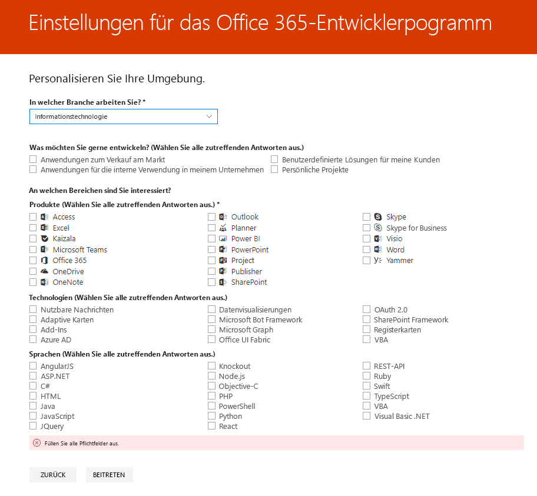
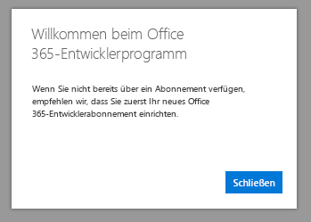

# Willkommen beim Office 365-EntwicklerprogrammWelcome to the Office 365 Developer Program

Überzeugen Sie Ihre Freunde und Kollegen vom Office 365-Entwicklerprogramm.Join your friends and colleagues in the Office 365 Developer Program. Verwenden Sie das Office 365-Entwicklerabonnement, um unabhängig von Ihrer Produktionsumgebung Lösungen zu entwickeln.Use the Office 365 developer subscription to develop your solutions independent of your production environment. Sie können Lösungen für Microsoft Teams, Office-Add-Ins, Microsoft Graph, SharePoint Framework, SharePoint-Add-Ins und vieles mehr erstellen.You can build solutions for Microsoft Teams, Office Add-ins, Microsoft Graph, SharePoint Framework, SharePoint Add-ins, and more.

## Treten Sie dem Office 365-Entwicklerprogramm bei.Join the Office 365 Developer Program

1. Rufen Sie die Seite [Treten Sie dem Office 365-Entwicklerprogramm bei](https://developer.microsoft.com/office/dev-program) auf.Go to the [Join the Office 365 Developer Program](https://developer.microsoft.com/office/dev-program) page. 

2. Wählen Sie in der oberen rechten Ecke **Anmelden** aus, um sich mit Ihrem Microsoft-Konto oder Ihrem Azure Active Directory-fähigen E-Mail-Konto anzumelden.In the upper-right corner, choose **Sign in** to sign in with your Microsoft account or Azure Active Directory-enabled email. 

  

3. Wählen Sie nach der Anmeldung **Jetzt beitreten** aus.After signing in, choose **Join now**.

4. Füllen Sie auf der Seite **Registrierung beim Office 365-Entwicklerprogramm** die folgenden Felder im Onlineformular aus:On the **Office 365 Developer Program Signup** page, complete the following fields in the online form:

  - **Kontakt-E-Mail****Contact Email**
  - **Land/Region****Country/Region**
  - **Unternehmen****Company**

  

5. Lesen Sie die **Geschäftsbedingungen**.Review the **terms and conditions**. Sie müssen das Kontrollkästchen aktivieren, bevor Sie beitreten können.You'll need to select the check box before you can join.

6. Aktivieren Sie optional das Kontrollkästchen **Ich möchte Informationen, Tipps und Angebote zum Office 365-Entwicklerprogramm erhalten**, wenn Sie über neue Funktionen und andere Updates von Microsoft informiert werden möchten.Optionally, select the **I would like to hear from the Office 365 Developer Program** check box if you want to hear from Microsoft about new capabilities and other updates. 

7. Wählen Sie **Weiter** aus.Choose **Next**.

8. Teilen Sie uns auf der Seite **Einstellungen für das Office 365-Entwicklerprogramm** Ihre Wünschen mit, damit wir Ihre Erfahrung personalisieren können, z. B.:On the **Office 365 Developer Program Preferences** page, tell us your preferences so we can personalize your experience, including:

  - Die Branche, in der Sie arbeiten.The industry that you work in.
  - Die Art von Anwendungen oder Lösungen, die Sie entwickeln möchten.The type of applications or solutions that you're interested in developing.
  - Produkte, Technologien und Programmiersprachen, an denen Sie interessiert sind.Products, technologies, and programming languages that you're interested in.

  

9. Klicken Sie nach Abschluss des Vorgangs auf **Beitreten**.When you're finished, choose **Join**. Ihre Einstellungen werden auf der nächsten Seite in der oberen rechten Ecke angezeigt, und es wird eine Begrüßungsnachricht angezeigt.Your preferences appear on the next page in the top right, and you receive a Welcome message.

  

## Nächste SchritteNext steps

- [Richten Sie ein Office 365-Entwicklerabonnement](office-365-developer-program-get-started.md) ein.[Set up an Office 365 developer subscription](office-365-developer-program-get-started.md). 

- Nachdem Sie ein Entwicklerabonnement abgeschlossen haben, [verwenden Sie Ihr Abonnement](build-office-365-solutions.md), um die gewünschten Lösungen zu erstellen.After you have your developer subscription, [use your subscription](build-office-365-solutions.md) to build the types of solutions that you want.

- Informationen zu ablaufende Abonnements finden Sie unter [Ablauf und Verlängerung für das Abonnement](subscription-expiration-and-renewal.md).For information about expiring subscriptions, see [Subscription expiration and renewal](subscription-expiration-and-renewal.md).

- Häufig gestellte Fragen zum Office 365-Entwicklerprogramm finden Sie in den [Häufig gestellten Fragen](office-365-developer-program-faq.md).For frequently asked questions about the Office 365 Developer Program, see the [FAQ](office-365-developer-program-faq.md).

