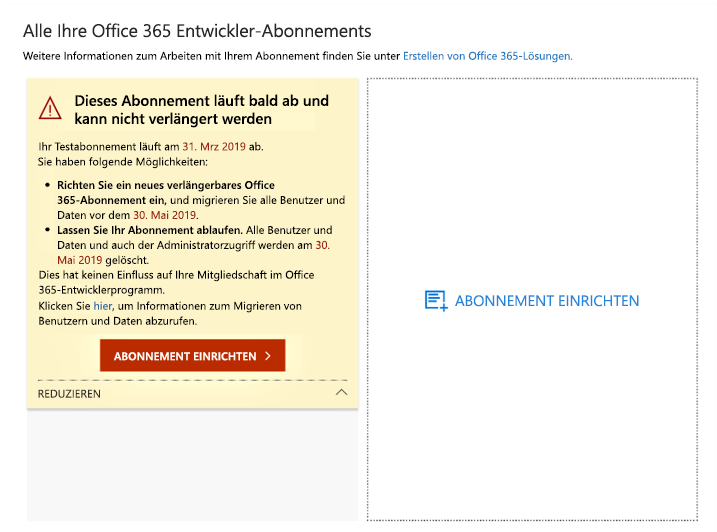
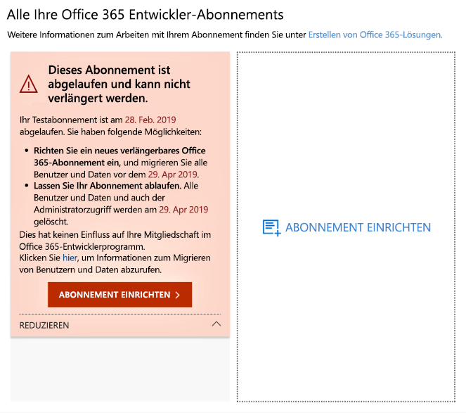
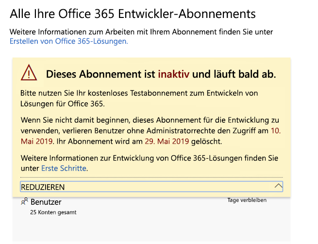
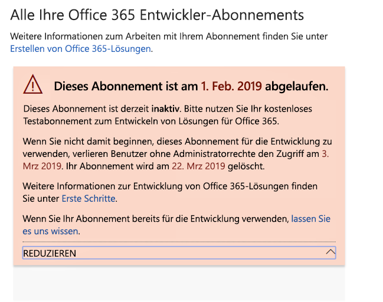
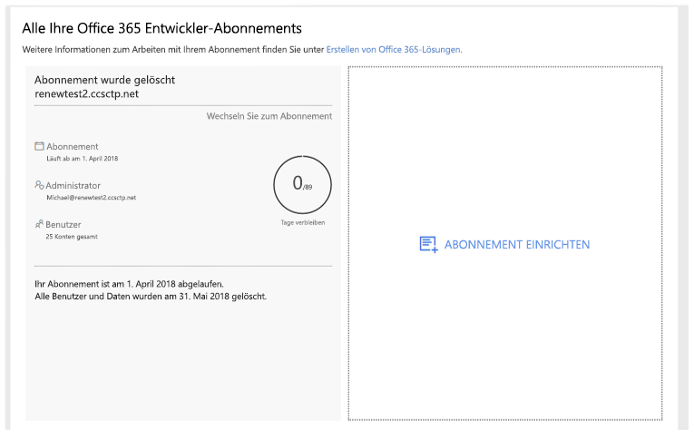

# Microsoft 365-Entwicklerprogramm – Ablauf und Verlängerung des Abonnements

Ihre Mitgliedschaft im Microsoft 365-Entwicklerprogramm beinhaltet ein kostenloses Office 365 E3-oder Microsoft 365 E5-Entwicklerabonnement. Ihr Entwicklerabonnement ist je nach Entwicklungsaktivität verlängerbar; einige ältere Abonnements laufen jedoch aus. Dieser Artikel beschreibt den Unterschied zwischen verlängerbaren und nicht verlängerbaren Abonnements und wie Sie Ihr Abonnement aktualisieren können, wenn es abläuft.

## Ablaufende im Vergleich zu verlängerbaren Entwicklerabonnements

Mit dem Start des Microsoft 365-Entwicklerprogramms haben wir 12-monatige Entwicklerabonnements angeboten, die ablaufen und nicht verlängert werden können. Im August 2018 haben wir damit begonnen, einigen Mitgliedern des Entwicklerprogramms verlängerbare Abonnements anzubieten.

Ab April 2019 bieten wir verlängerbare 90-Tage-Abonnements an.

Sie können feststellen, ob Sie ein verlängerbares oder nicht verlängerbares Abonnement haben, indem Sie Ihr[Dashboard des Microsoft 365-Entwicklerprogramms](https://aka.ms/DevProgramDashboard) anzeigen.

## Nicht verlängerbare Abonnements

Wenn Sie sich vor August 2018 für Ihr Abonnement registriert haben, ist Ihr Abonnement nicht verlängerbar, und auf Ihrem Dashboard wird die folgende Warnung angezeigt. Sie müssen Ihr Abonnement vor Ablauf Ihres aktuellen Abonnements ersetzen. Der Warntext weist darauf hin, dass das Abonnement nicht verlängert werden kann. Wir schicken Ihnen auch eine E-Mail, um Sie daran zu erinnern, dass Ihr Abonnement abläuft.
 
 

Wenn Ihr Abonnement abläuft, wird der folgende Warntext angezeigt.

 

Um ein Ersatzabonnement zu erstellen, wählen Sie **Abonnement einrichten** aus. 

Außerdem müssen Sie alle wichtigen Daten, die Sie speichern müssen, in Ihr neues Abonnement migrieren. Weitere Informationen finden Sie unter [Wie migriere ich meine Daten?](#migrate-data) weiter unten in diesem Thema.

## Verlängerbare Abonnements

Wenn Sie sich nach August 2018 für Ihr Abonnement registriert haben, haben Sie möglicherweise ein verlängerbares Abonnement. Wenn Ihr Abonnement inaktiv ist, wird die folgende Warnung auf Ihrem Dashboard angezeigt. 

 

Wenn Ihr Abonnement abläuft, wird der folgende Warntext angezeigt.

 

Wenn Sie ein aktiver Entwickler sind, wird Ihr Abonnement automatisch um weitere 90 Tage nach dem ursprünglichen Ablaufdatum verlängert. 

## Warum ist mein aktuelles Abonnement nicht verlängerbar?

Wir haben im August 2018 verlängerbare Abonnements eingeführt. Wenn Sie sich vorher für Ihr Abonnement registriert haben, ist Ihr Abonnement nicht verlängerbar und Sie müssen ein neues einrichten, wenn es abläuft.

## Wie migriere ich meine Daten beim Ablauf meines Abonnements?

Informationen zur Migration Ihrer Daten von Ihrem aktuellen Abonnement zu einem neuen Abonnement finden Sie in den folgenden Ressourcen:

- [Migrieren von Postfächern von einem Mandanten zu einem anderen](https://docs.microsoft.com/exchange/mailbox-migration/migrate-mailboxes-across-tenants)
- [Verwenden von PowerShell zum Ausführen einer mehrstufigen Migration](https://docs.microsoft.com/office365/enterprise/powershell/use-powershell-to-perform-a-staged-migration-to-office-365)
- [Migration von einem Abonnement zu einem anderen Abonnement ohne Drittanbieter](https://social.technet.microsoft.com/Forums/en-US/ee507441-eb91-4b0a-ba6c-5bd9bb8c71b1/migration-from-one-o365-tenant-to-another-o365-without-third-party?forum=onlineservicesmigrationandcoexistence)

## Wie erfahre ich, ob mein Abonnement gelöscht wurde?

Wenn Ihr Abonnement gelöscht wird, zeigt Ihr Dashboard eine Benachrichtigung an, dass das Abonnement und seine ID gelöscht wurden, wie im folgenden Screenshot gezeigt. 

 

## Weitere Artikel

- [Teilnehmen am Microsoft 365-Entwicklerprogramm](microsoft-365-developer-program.md)
- [Einrichten eines Microsoft 365 Developer-Abonnements](microsoft-365-developer-program-get-started.md)
- [Verwenden Ihres Abonnements zum Erstellen von Microsoft 365-Lösungen](build-microsoft-365-solutions.md)
- [Häufig gestellte Fragen zum Microsoft 365-Entwicklerprogramm](microsoft-365-developer-program-faq.md)

